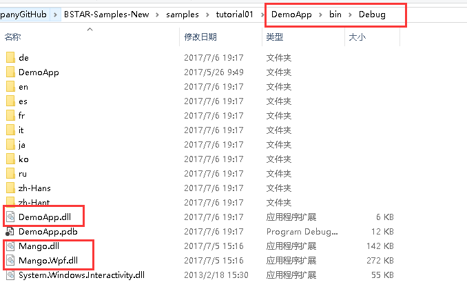

# 应用开发的基本流程

## 简单的应用

1. 打开`Visual Studio`软件（本教程使用的是2015中文版），新建解决方案及项目，命名为`DemoApp`，如下图所示，注意图片圈红处。

2. 选中项目->右键项目->点击`管理NuGet程序包`，如下图所示。

   


3. 在搜索栏输入`Mango.client`（注意不要输错，区分大小写），把`包括与发行版`也勾上，然后就会出现筑星PC端的公共库，下载安装即可。当有最新库出现的时候，在此处更新即可。

   

4. 选中项目，新建一个配置文件，命名为`config.app`，如下图所示。


5. 选中刚创建好的`config.app`，右键属性->复制到输出目录->选择` 如果较新则复制`，如下图所示。注意：应用的所有配置文件、资源文件都需要这一步的操作，切记。

   

6. 文件`config.app`的代码如下所示。新建的应用需要有应用开发密钥，这个需要在筑星官网进行申请，每一个应用的密钥都是唯一的有效的，随便填写的密钥是不能够被主程序加载的。注意：下面的密钥是无效的。`FileName`等号后要填`项目名.dll`(这里写`DemoApp.dll`)，否则应用不会被加载。

```xml
<?xml version="1.0" encoding="utf-8" ?>
<App Key="7893CBB8-A058-459B-A7E8-84149E5A0000"
        FileName="DemoApp.dll">
</App>
```

6. 选中项目，新建一个类`DemoApp.cs`，代码如下所示。

```c#
using Mango;
namespace DemoApp
{
    public class DemoApp : App
    {
        protected override async Task OnStartupAsync()
        {
            //加载应用时，执行的代码
            this.ShowMessage("我的应用启动了！");//弹框
            await Task.Yield();
        }

        protected override void OnExited()
        {
            //卸载应用时，执行的代码
            this.ShowMessage("我的应用卸载了！");//弹框
        }
    }
}
```

7. 右键项目->属性->调试->选择`启动外部程序`，将启动程序设为`Shell.Wpf.exe`，即可进行调试，如下图所示。`Shell.Wpf.exe`所在位置为软件`BIM-STAR2017`安装所在的目录下，我这里安装在D盘，请根据实际情况选择。

   


8. 选择`Debug`模式，按F5运行项目，在登录界面输入自己的账号密码，进入起始页面后，点击进入任意一个项目，就会弹出一个窗口，效果如下图所示，说明刚创建的应用成功地被加载了。注销登录，就会出现`我的应用卸载了！`的弹框。注意：应用只有在进入项目之后才会被按照加载顺序进行加载，在注销登录之后就会按照顺序进行卸载。

   

9. `Debug`模式下，设为启动项目的应用才会被加载，如果是下面这种情况，有两个应用项目，`AnotherApp`项目作为启动项目将被加载，则`DemoApp`这个项目的应用将不会被加载。

   

10. 当然了，也可以不在`Debug`模式下就能够加载`DemoApp`这个应用，最简单的方法就是把`DemoApp`这个项目文件夹下的`bin`->`Debug`文件夹复制到`BIM-STAR2017`所在目录的`Apps`文件夹下，如下图所示。最好以`项目名`命名文件夹，这个时候就可以双击`BIM-STAR2017`的快捷方式打开程序，可以发现`DemoApp`也能被系统加载了。

   

   

11. 如果想两个应用都被加载，那么应该把两个应用编译成功后的`Debug`文件复制到`BIM-STAR2017`所在目录的`Apps`文件夹下，不过这个时候是无法调试的，需要调试，请在`Debug`模式下运行。


## 应用的配置文件详解

+ 完整的`config.app`配置文件内容如下：

```xml
<?xml version="1.0" encoding="utf-8"?>
<App Key="8EC659FB-D1D0-4DDA-BBDF-0BD8803C0000"
     FileName="DemoApp.dll"
     Name="Demo应用"
     Version="1.0.0.0"
     Description="Demo应用是一个什么样的应用。"
     Developer="XXX科技有限公司"
     LoadOrder="0"
     WebUrl="http://www.XXXX.com">
  <Modules>
    <Module Key="B7D085FC-238C-4BB8-AA1C-433BC98E0000" Name="增加数据" Description="增加数据操作" Group="Demo模块组" EveryoneAccess="true"/>
    <Module Key="3BA674C7-1D11-4744-8FC6-B887AC380000" Name="删除数据" Description="删除数据操作" Group="Demo模块组" EveryoneAccess="false"/>
    <Module Key="BE02A510-175A-4C86-BDE9-D3EFBAA30000" Name="修改数据" Description="修改数据操作" Group="Demo模块组" EveryoneAccess="false"/>
</App>
```

|     属性名称      | 描述                  | 是否必填   |
| :-----------: | ------------------- | ------ |
|     `Key`     | 应用唯一编号，一个有效的`Guid`值 | **是**  |
|  `FileName`   | 应用所在的dll名称          | **是**  |
|    `Name`     | 应用名称                | 否      |
| `Description` | 应用描述                | 否      |
|  `Developer`  | 应用的开发者              | 否      |
|  `LoadOrder`  | 应用加载的顺序             | 否，默认为0 |
|   `WebUrl`    | 应用开发者的官网            | 否      |
|    `Icon`     | 应用图标，图标必须在应用所在的文件夹下 | 否      |

+ Modules节点下表示该应用的内部模块分布（用于权限管理），如果该应用内部没有模块，可省略该节点。Module节点的属性分布如下：

| 属性名称             | 描述                | 是否必填          |
| ---------------- | ----------------- | ------------- |
| `Key`            | 模块唯一编号，一个有效的Guid值 | **是**         |
| `Name`           | 模块名称              | **是******     |
| `Description`    | 模块描述              | 否             |
| `Group`          | 模块组名              | 否，默认为Function |
| `EveryoneAccess` | 模块初始权限，是否每个人都可以操作 | 否             |

## 应用的目录结构

+ 比较完整的应用项目目录如下图所示。

  


+ 上图的这些文件作用如下表格所示。

| 名称            | 作用                         | 是否文件夹 |
| ------------- | -------------------------- | ----- |
| `Apis`        | 放置连接Api的方法                 | **是** |
| `Assets`      | 放置应用中需要用到的图片资源             | **是** |
| `Controls`    | 放置应用中的自定义控件                | **是** |
| `Converters`  | 放置类型转换器（类命名规则：XxxToXxxCvt） | **是** |
| `Entities`    | 放置应用中实体类的定义文件              | **是** |
| `Enums`       | 放置一些枚举类                    | **是** |
| `Models`      | Model层                     | **是** |
| `RibbonTabs`  | 放置Ribbon菜单的定义文件（xml文件）     | **是** |
| `Utils`       | 放置一些常用到的公用方法               | **是** |
| `ViewModels`  | ViewModel层                 | **是** |
| `Views`       | View层                      | **是** |
| `_config.xml` | 本地配置文件（可省略）                | 否     |
| `config.app`  | 应用配置文件                     | 否     |
| `DemoApp.cs`  | 应用入口                       | 否​    |


## 创建应用的常见问题

- 凡是在应用项目中添加的资源文件、`config.app`、`_config.xml`（配置文件）、放置`Ribbon`菜单的定义文件（`xml`）等等都需要右键属性->复制到输出目录->选择`如果较新则复制`，否则加载应用时就会找不到对应的资源文件，提示：可以在进入项目后，点击菜单栏->工具->输出，打开输出栏就可以看到`找不到xxx资源`的提示。
- 需要引用到的库一般都能在筑星提供的`libs`文件夹中找到。
- 提供的所有示例源码均不可以直接运行，因为`config.app`中的应用密钥都是无效的。
- 提供的所有示例源码运行后都需进入项目->点击我的菜单->我的按钮才会显示出源码所展示的界面。