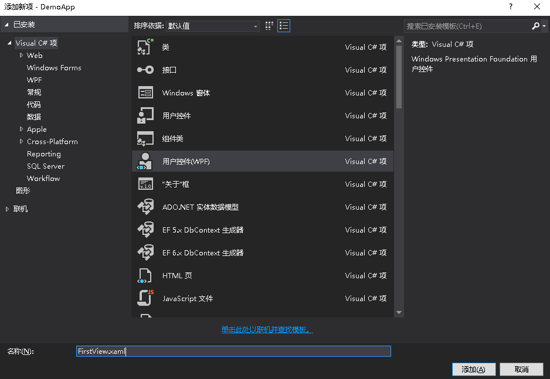
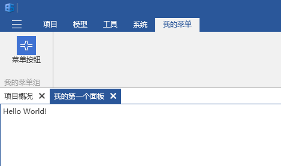
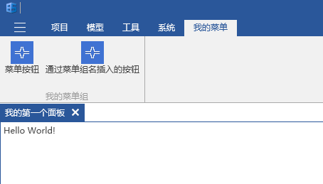

# 面板的设置

## 面板的显示

+ 这一章是在您已经学会在BIM-STAR2017上创建最简单的应用的基础上进行讲解的。

1. 选中项目，在项目下新建一个`Views`文件夹，然后在该文件夹下新建一个`FirstView.xaml`文件，如下图所示。

   

2. 创建`FirstView.xaml`文件后，`FirstView.xaml`文件中的内容：`<Grid>`可能会出现`类型'UserControl'不支持直接内容`的错误提示，右键引用->`添加引用`->`程序集`->`框架`->找到` System.Xaml`之后就可以解决这个问题了。`FirstView.xaml`的代码如下所示。

   ```html
   <UserControl x:Class="DemoApp.Views.FirstView"
                xmlns="http://schemas.microsoft.com/winfx/2006/xaml/presentation"
                xmlns:x="http://schemas.microsoft.com/winfx/2006/xaml"
                xmlns:mc="http://schemas.openxmlformats.org/markup-compatibility/2006"
                xmlns:d="http://schemas.microsoft.com/expression/blend/2008"
                xmlns:local="clr-namespace:DemoApp.Views"
                mc:Ignorable="d"
                d:DesignHeight="300" d:DesignWidth="300">
       <Grid>
           <TextBlock Text="Hello World!" />
       </Grid>
   </UserControl>
   ```

3. 选中项目，在项目下新建`ViewModels`文件夹，在该文件夹下新建一个`FirstViewModel.cs`文件，代码如下所示。虽然在这里不需要执行什么代码，但还是需要创建这个类的。这个类是用来处理`FirstView.xaml`界面的业务逻辑。

   ```c#
   using Mango;
   namespace DemoApp.ViewModels
   {
       public class FirstViewModel : ViewModelBase
       {
       }
   }
   ```

4. 选中项目，在项目下新建一个`Assets`文件夹，在该文件夹下任意添加一个图标图片，命名为`logo.jpg`。注意：不要忘了右键该图片的属性->复制到输出目录->选择` 如果较新则复制`。

5. 选中项目，在项目下新建一个`RibbonTabs`文件夹，在该文件夹下新建一个`MyTab.xml`文件，注意是`xml`文件，该文件是用来在菜单栏上添加菜单按钮的。代码内容如下。`LargeImage`对应的是菜单按钮的大图标，`SmallImage`对应的是小图标，`Click`对应的是菜单按钮的点击事件名。注意：不要忘了右键该文件的属性->复制到输出目录->选择` 如果较新则复制`。

   ```xml
   <?xml version="1.0" encoding="utf-8" ?>
   <Tab Name = "MyTab" Header="我的菜单">
     <Group Name = "MyFirstGroup" Header="我的菜单组">
       <Button Text = "菜单按钮" ButtonSize="Large" CollapseToMedium="Never" LargeImage="logo.jpg" SmallImage="logo.jpg" Click="OpenMyFirstPane" />
     </Group>
   </Tab>
   ```

6. 在`ViewModels`文件夹下新建一个`RibbonTabs`文件夹，在该文件夹下新建一个`MyTabViewModel.cs`文件，该文件是用来解析上面的`MyTab.xml`文件、并提供点击事件的。文件代码如下所示。

   ~~~c#
   using Mango;
   using Mango.ViewModels;

   namespace DemoApp.ViewModels.RibbonTabs
   {
       public class MyTabViewModel : RibbonTabViewModel
       {
           public MyTabViewModel()
               : base(@"RibbonTabs\MyTab.xml", "Assets")//对应菜单配置文件和图片的文件夹名称
           {
           }

           protected override void OnLoadingLayout()
           {
               base.OnLoadingLayout();
               RegisterCommand("OpenMyFirstPane", OnOpenMyFirstPane);//注册菜单配置文件中的按钮点击事件名
           }

           private void OnOpenMyFirstPane()
           {
               Mg.Get<IMgDocking>().TryOpenPane<DemoApp, FirstViewModel>(t =>
               {
                   t.Header = "我的第一个面板";
                   t.IsDocument = true;
                   return new FirstViewModel();
               });
           }
       }
   }
   ~~~

7. 此时`DemoApp.cs`文件中的代码如下所示。通过`Mg.Get<IMgRibbon>().InsertRibbonTab`方法将我们自定义好的菜单添加到BIM-STAR的菜单栏上。

   ~~~C#
   using System.Threading.Tasks;
   using DemoApp.ViewModels.RibbonTabs;
   using Mango;
   namespace DemoApp
   {
       public class DemoApp : App
       {
           protected override async Task OnStartupAsync()
           {
               //插入RibbonTab
               Mg.Get<IMgRibbon>().InsertRibbonTab(this, new MyTabViewModel());
               await Task.Yield();
           }
           protected override void OnExited()
           {
           }
       }
   }
   ~~~

8. 按F5运行项目，登录之后点击任意项目，此时菜单栏的效果如下所示。点击菜单按钮就会出现我们所设置的面板。

   

9. 除了自己配置菜单栏，也可以在一个已知的菜单组里添加一个新的菜单按钮。具体操作如下：新建一个`_config.xml`配置文件，代码如下。注意：不要忘了右键该配置文件的属性->复制到输出目录->选择` 如果较新则复制`。`MyFirstGroup`是我们上面设置的菜单组组名，下面将通过另外一种方式往这个菜单组里添加一个菜单按钮。所以当你想要往别的菜单组添加菜单按钮的时候，必须要知道他的菜单组的组名。

   ```xml
   <?xml version="1.0" encoding="utf-8" ?>
   <Root InsertGroupName="MyFirstGroup">
   </Root>
   ```

10. 新建一个`LocalConfig.cs`文件，代码如下所示。该文件是用来获取`_config.xml`配置文件中的数据。

```c#
   using System.Xml.Linq;
   using Mango;
   namespace DemoApp
   {
       public static class LocalConfig
       {
           static LocalConfig()
           {
               var root = XDocument.Load(typeof(LocalConfig).GetAppResPath("_config.xml")).Root;
               InsertGroupName = root.Attribute("InsertGroupName").Value;
           }
           public static string InsertGroupName { get; }
       }
   }
```

11. 此时`DemoApp.cs`文件中的代码如下所示。当然了，`LocalConfig.InsertGroupName`也可以直接改为字符串`"MyFirstGroup"`，不过这样很容易写死，不利于灵活修改，不推荐这样。值得一提的是`Mg.Get<IMgDocking>().TryOpenPane`方法对于同一个`ViewModel`（这里指的是`FirstViewModel`）只会打开一次，就是说不管你点了多少次菜单按钮，结果都只会出现一次面板。

```c#
   using System.Threading.Tasks;
   using DemoApp.ViewModels;
   using DemoApp.ViewModels.RibbonTabs;
   using Mango;
   using Mango.ViewModels;
   namespace DemoApp
   {
       public class DemoApp : App
       {
           private RibbonButtonViewModel _viewBtn;
           private RibbonGroupViewModel _groupVm;
           protected override async Task OnStartupAsync()
           {
               //插入RibbonTab
               Mg.Get<IMgRibbon>().InsertRibbonTab(this, new MyTabViewModel());
               //在已有的菜单组中插入菜单按钮
               _groupVm = Mg.Get<IMgRibbon>().GetRibbonGroup(LocalConfig.InsertGroupName);
               if (_groupVm != null)
               {
                   _viewBtn = new RibbonButtonViewModel
                   {
                       ButtonSize = ButtonSize.Large,
                       Text = "通过菜单组名插入的按钮",
                       LargeImage = this.GetAppResPath("Assets\\logo.jpg"),
                       SmallImage = this.GetAppResPath("Assets\\logo.jpg"),
                       Click = new RelayCommand(ShowPane)//按钮命令
                   };
                   _groupVm.Items.Add(_viewBtn);
               }
               else
               {
                   Mg.Get<IMgLog>().Warn($"没有找到名称为{LocalConfig.InsertGroupName}的菜单组,无法插入菜单按钮！");
               }
               await Task.Yield();
           }
           protected override void OnExited()
           {
               //移除按钮
               _groupVm?.Items.Remove(_viewBtn);
           }
           private void ShowPane()
           {
               Mg.Get<IMgDocking>().TryOpenPane<DemoApp, FirstViewModel>(t =>
               {
                   t.Header = "我的第一个面板";
                   t.IsDocument = true;
                   return new FirstViewModel();
               });
           }
       }
   }
```

11. 按F5运行项目，登录->点击进入任意项目，此时菜单栏的效果如下所示。通过点击`通过菜单组名插入的按钮`出现面板。


## 面板的主要初始属性

| 属性名               | 类型              | 作用                       |
| ----------------- | --------------- | ------------------------ |
| `Header`          | `string`        | 面板标题                     |
| `InitialPosition` | `DockState（枚举）` | 面板所处界面的位置，默认是在左边。        |
| `IsActive`        | `bool`          | 面板是否处于激活状态，默认是true       |
| `IsHidden`        | `bool`          | 面板是否处于隐藏状态，默认是false      |
| `IsDocument`      | `bool`          |                          |
| `CanUserClose`    | `bool`          | 用户是否可以关闭面板，默认是false      |
| `CanFloat`        | `bool`          |                          |
| `IsFrontMode`     | `bool`          |                          |
| `IgnoreFrontMode` | `bool`          | 会如同图形平台面板一样依附起始页，默认false |
| `ShowHeader`      | `bool`          | 面板标题是否显示                 |
| `CanUserClose`    | `bool`          |                          |
| `Content`         | `object`        |                          |


​