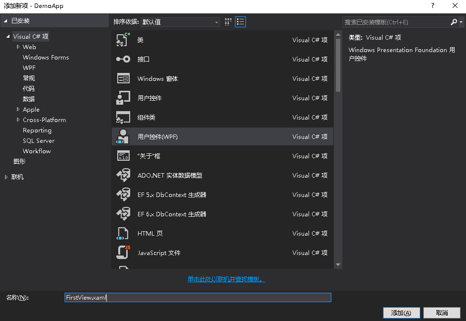
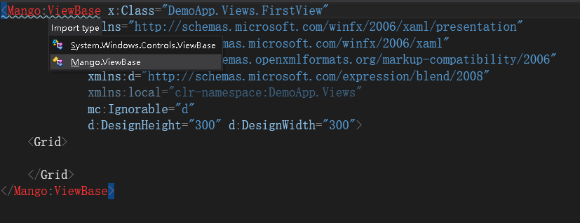
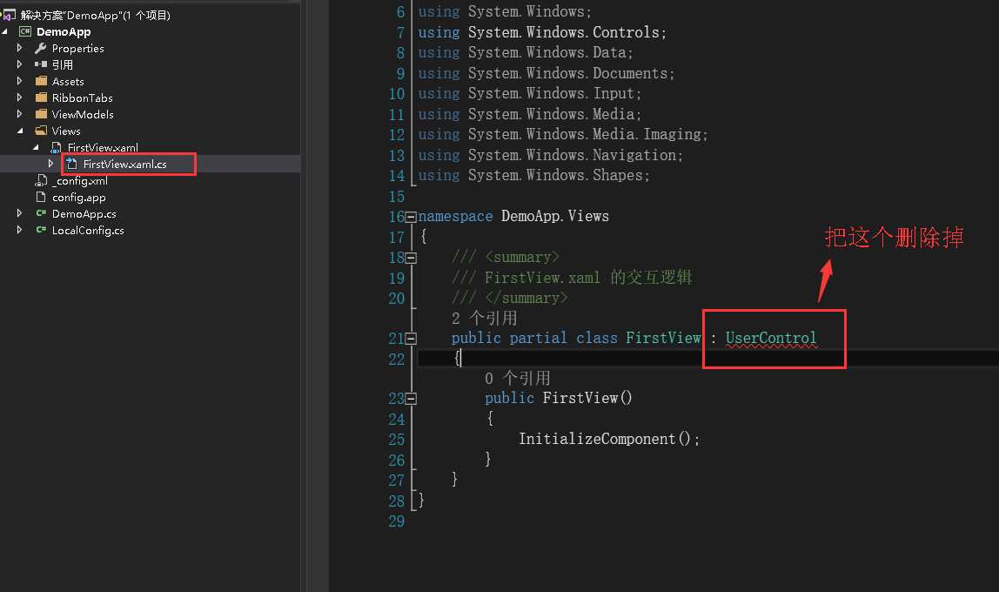
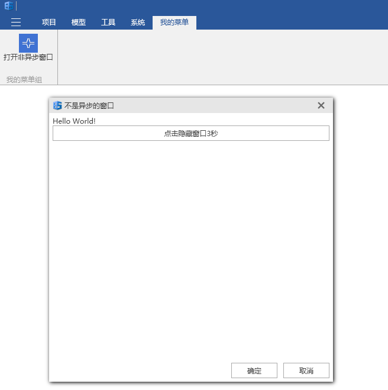
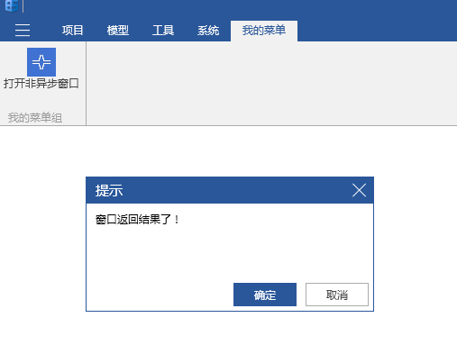
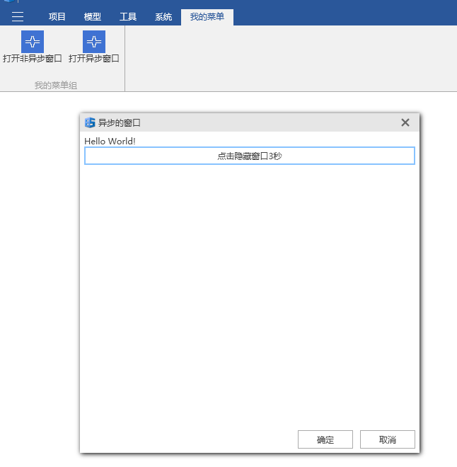

# 窗口的设置

+ 这一章是在您已经学会在BIM-STAR2017上创建最简单的应用的基础上进行讲解的。
+ 有时候需要把展示的界面用窗口的形式显示出来，那么有以下两种方式可以显示窗口。


## 非异步窗口的显示

1. 选中项目，在项目下新建`Views`文件夹，在该文件夹下新建一个`FirstView.xaml`文件。

   

2. 创建`FirstView.xaml`文件后，`FirstView.xaml`文件中的内容：`<Grid>`可能会出现`类型'UserControl'不支持直接内容`的错误提示，右键引用->`添加引用`->`程序集`->`框架`->找到` System.Xaml`之后就可以解决这个问题了。`FirstView.xaml`的代码如下所示。

   ```html
   <UserControl x:Class="DemoApp.Views.FirstView"
                xmlns="http://schemas.microsoft.com/winfx/2006/xaml/presentation"
                xmlns:x="http://schemas.microsoft.com/winfx/2006/xaml"
                xmlns:mc="http://schemas.openxmlformats.org/markup-compatibility/2006" 
                xmlns:d="http://schemas.microsoft.com/expression/blend/2008" 
                xmlns:local="clr-namespace:DemoApp.Views"
                mc:Ignorable="d" 
                d:DesignHeight="300" d:DesignWidth="300">
       <Grid>
               
       </Grid>
   </UserControl>
   ```

3. 在`FirstView.xaml`代码中，把`UserControl`改为`mango:ViewBase`，这个时候会出现如下所示的情况。然后左键点击选择`Mango.ViewBase`，为什么要这样改，是因为`mango:ViewBase`里具有一些框架提供的特性，如果界面文件不这么改的话，后面的教程需要的一些特性将无法使用。切记，每个`xaml`文件都这么改就对了。

   

4. 在`FirstView.xaml`代码中，这个时候`<Grid>`可能会出现`类型'ViewBase'不支持直接内容`的错误提示，打开`FirstView.xaml.cs`文件，把如图所示的`:UserControl`去掉，保存文件内容。

   

5. 此时，在`FirstView.xaml`完整的代码如下所示。注意：如果还遇到`<Grid>`可能会出现`类型'ViewBase'不支持直接内容`的错误提示，再重新编译一下项目，此时`FirstView.xaml`中的`<Grid>`就不会报错了。

   ```html
   <mango:ViewBase x:Class="DemoApp.Views.FirstView"
                xmlns="http://schemas.microsoft.com/winfx/2006/xaml/presentation"
                xmlns:x="http://schemas.microsoft.com/winfx/2006/xaml"
                xmlns:mc="http://schemas.openxmlformats.org/markup-compatibility/2006"
                xmlns:d="http://schemas.microsoft.com/expression/blend/2008"
                xmlns:local="clr-namespace:DemoApp.Views"
                xmlns:mango="clr-namespace:Mango;assembly=Mango.Wpf"
                mc:Ignorable="d"
                d:DesignHeight="300" d:DesignWidth="300">
       <Grid>
           <Grid.RowDefinitions>
               <RowDefinition Height="Auto" />
               <RowDefinition Height="Auto" />
           </Grid.RowDefinitions>
           <TextBlock Text="Hello World!" />
           <Button Grid.Row="1" Content="点击隐藏窗口3秒" Command="{Binding ButtonClick}" />
       </Grid>
   </mango:ViewBase>
   ```

6. 选中项目，在项目下新建`ViewModels`文件夹，在该文件夹下新建一个`FirstViewModel.cs`文件，代码如下所示。这个类是用来处理`FirstView.xaml`界面的业务逻辑。`ButtonClick`绑定的是`FirstView.xaml`界面的`Button`按钮的点击事件，`OnButtonClick()`是点击事件需要执行的方法。

   ```c#
   using System.Threading.Tasks;
   using Mango;

   namespace DemoApp.ViewModels
   {
       public class FirstViewModel : ViewModelBase
       {
           public FirstViewModel()
           {
               ButtonClick = new RelayCommand(OnButtonClick, CanButtonClick);
           }

           public RelayCommand ButtonClick { get; private set; }

           private bool CanButtonClick()
           {
               return true;
           }

           private async void OnButtonClick()
           {
               Hide();//隐藏界面
               await Task.Delay(3000);//等待3秒钟
               Show();//显示界面
           }
       }
   }
   ```

7. 选中项目，在项目下新建一个`Assets`文件夹，在该文件夹下任意添加一个图标图片，命名为`logo.jpg`。注意：不要忘了右键该图片的属性->复制到输出目录->选择` 如果较新则复制`。

8. 选中项目，在项目下新建一个`RibbonTabs`文件夹，在该文件夹下新建一个`MyTab.xml`文件，代码如下。该文件是为了在菜单栏上插入一个菜单组。`MyFirstGroup`是我们设置的菜单组组名。注意：不要忘了右键该文件的属性->复制到输出目录->选择` 如果较新则复制`。

   ```xml
   <?xml version="1.0" encoding="utf-8" ?>
   <Tab Name = "MyTab" Header="我的菜单">
     <Group Name = "MyFirstGroup" Header="我的菜单组">
     </Group>
   </Tab>
   ```

9. 在`ViewModels`文件夹下新建一个`RibbonTabs`文件夹，在该文件夹下新建一个`MyTabViewModel.cs`文件，代码内容如下。

   ```c#
   using Mango;
   using Mango.ViewModels;

   namespace DemoApp.ViewModels.RibbonTabs
   {
       public class MyTabViewModel : RibbonTabViewModel
       {
           public MyTabViewModel()
               : base(@"RibbonTabs\MyTab.xml", "Assets")//对应菜单配置文件和图片的文件夹名称
           {
           }
       }
   }
   ```

10. 在项目下新建一个`_config.xml`配置文件，代码如下。注意：不要忘了右键该图片的属性->复制到输出目录->选择` 如果较新则复制`。`MyFirstGroup`是我们上面设置的菜单组组名。

```html
      <?xml version="1.0" encoding="utf-8" ?>
      <Root InsertGroupName="MyFirstGroup">
      </Root>
```

11.  新建一个`LocalConfig.cs`文件，代码如下所示。该文件是用来获取`_config.xml`配置文件中的数据。新建一个新建一个`LocalConfig.cs`文件，代码如下所示。

```C#
using System.Xml.Linq;
   using Mango;
   namespace DemoApp
   {
       public static class LocalConfig
       {
           static LocalConfig()
           {
               var root = XDocument.Load(typeof(LocalConfig).GetAppResPath("_config.xml")).Root;
               InsertGroupName = root.Attribute("InsertGroupName").Value;
           }
           public static string InsertGroupName { get; }
       }
   }
```

12.  此时`DemoApp.cs`文件中的代码如下所示。

```C#
using System.Threading.Tasks;
using DemoApp.ViewModels;
using DemoApp.ViewModels.RibbonTabs;
using Mango;
using Mango.ViewModels;

namespace DemoApp
{
    public class DemoApp : App
    {
        private RibbonButtonViewModel _viewBtn;
        private RibbonGroupViewModel _groupVm;

        protected override async Task OnStartupAsync()
        {
            //插入菜单组
            Mg.Get<IMgRibbon>().InsertRibbonTab(this, new MyTabViewModel());
            //在已有的菜单组中插入菜单按钮
            _groupVm = Mg.Get<IMgRibbon>().GetRibbonGroup(LocalConfig.InsertGroupName);
            if (_groupVm != null)
            {
                _viewBtn = new RibbonButtonViewModel
                {
                    ButtonSize = ButtonSize.Large,
                    Text = "打开非异步窗口",
                    LargeImage = this.GetAppResPath("Assets\\logo.jpg"),
                    SmallImage = this.GetAppResPath("Assets\\logo.jpg"),
                    Click = new RelayCommand(ShowWindow)//按钮命令
                };
                _groupVm.Items.Add(_viewBtn);//添加到菜单组里
            }
            else
            {
                Mg.Get<IMgLog>().Warn($"没有找到名称为{LocalConfig.InsertGroupName}的菜单组,无法插入菜单按钮！");
            }
            await Task.Yield();
        }

        protected override void OnExited()
        {
            //移除按钮
            _groupVm?.Items.Remove(_viewBtn);
        }

        private void ShowWindow()
        {
            var firstVm = new FirstViewModel();
            var vm = new DialogViewModel(firstVm)
            {
                Title = "不是异步的窗口",
                Width = 500,
                Height = 500
            };
            var result = Mg.Get<IMgDialog>().ShowDialog(vm);//非异步窗口
            this.ShowMessage("窗口返回结果了！");
            if (result == CloseResult.Ok)
            {
                //点击窗口的确定按钮后需要执行的代码
            }
        }
    }
}
```

13.   按F5运行项目，登录之后点击进入任意项目，此时菜单栏的效果如下所示。通过点击`我的菜单`->`打开非异步窗口`按钮出现窗口。这个时候通过操作可以发现，除了窗口内的界面可以操作之外（比如按钮点击事件），整个程序的其它地方都不可以操作了。

 

14.  点击`点击隐藏窗口3秒`按钮把窗口隐藏了，这个时候就可以操作除窗口外的其它地方了，但是把窗口隐藏之后，这个非异步窗口会马上返回结果，即`DemoApp.cs`文件中的`var result = Mg.Get<IMgDialog>().ShowDialog(vm)`该语句将会获取到窗口返回的值，`this.ShowMessage("窗口返回结果了！")`该语句将会弹出一个提示界面会如下所示。当窗口显示回来的时候，再点击确定按钮，此时窗口不再返回值了，因为之前隐藏的时候它已经返回过一次值了，这就是非异步窗口的局限性。



## 异步窗口的显示

- 有的时候需要操作窗口之外的其他界面，但是并不希望马上返回窗口结果值，而是点击窗口的确定按钮之后才返回窗口结果值，这个时候可以通过使用异步窗口达到这种效果。

1. `DemoApp.cs`文件中完整的代码如下。异步窗口的调用其实上就是`Mg.Get<IMgDialog>()`的`ShowDialogAsync()`方法的调用。

   ```C#
   using System.Threading.Tasks;
   using DemoApp.ViewModels;
   using DemoApp.ViewModels.RibbonTabs;
   using Mango;
   using Mango.ViewModels;

   namespace DemoApp
   {
       public class DemoApp : App
       {
           private RibbonButtonViewModel _viewBtn;
           private RibbonButtonViewModel _viewBtnAsync;
           private RibbonGroupViewModel _groupVm;

           protected override async Task OnStartupAsync()
           {
               //插入菜单组
               Mg.Get<IMgRibbon>().InsertRibbonTab(this, new MyTabViewModel());
               //在已有的菜单组中插入菜单按钮
               _groupVm = Mg.Get<IMgRibbon>().GetRibbonGroup(LocalConfig.InsertGroupName);
               if (_groupVm != null)
               {
                   _viewBtn = new RibbonButtonViewModel
                   {
                       ButtonSize = ButtonSize.Large,
                       Text = "打开非异步窗口",
                       LargeImage = this.GetAppResPath("Assets\\logo.jpg"),
                       SmallImage = this.GetAppResPath("Assets\\logo.jpg"),
                       Click = new RelayCommand(ShowWindow)//按钮命令
                   };
                   _groupVm.Items.Add(_viewBtn);//添加到菜单组里
                   _viewBtnAsync = new RibbonButtonViewModel
                   {
                       ButtonSize = ButtonSize.Large,
                       Text = "打开异步窗口",
                       LargeImage = this.GetAppResPath("Assets\\logo.jpg"),
                       SmallImage = this.GetAppResPath("Assets\\logo.jpg"),
                       Click = new RelayCommand(ShowWindowAsync)//按钮命令
                   };
                   _groupVm.Items.Add(_viewBtnAsync);//添加到菜单组里
               }
               else
               {
                   Mg.Get<IMgLog>().Warn($"没有找到名称为{LocalConfig.InsertGroupName}的菜单组,无法插入菜单按钮！");
               }
               await Task.Yield();
           }

           protected override void OnExited()
           {
               //移除按钮
               _groupVm?.Items.Remove(_viewBtn);
               _groupVm?.Items.Remove(_viewBtnAsync);
           }

           private void ShowWindow()
           {
               var firstVm = new FirstViewModel();
               var vm = new DialogViewModel(firstVm)
               {
                   Title = "不是异步的窗口",
                   Width = 500,
                   Height = 500
               };
               var result = Mg.Get<IMgDialog>().ShowDialog(vm);//非异步窗口
               this.ShowMessage("窗口返回结果了！");
               if (result == CloseResult.Ok)
               {
                   //点击窗口的确定按钮后需要执行的代码
               }
           }

           private async void ShowWindowAsync()
           {
               var firstVm = new FirstViewModel();
               var vm = new DialogViewModel(firstVm)
               {
                   Title = "异步的窗口",
                   Width = 500,
                   Height = 500
               };
               var result = await Mg.Get<IMgDialog>().ShowDialogAsync(vm);//异步窗口
               this.ShowMessage("窗口返回结果了！");
               if (result == CloseResult.Ok)
               {
                   //点击窗口的确定按钮后需要执行的代码
               }
           }
       }
   }
   ```

2. 按F5运行项目，登录之后点击进入任意项目，此时菜单栏的效果如下所示。通过点击`我的菜单`->`打开异步窗口`按钮出现窗口。

   

3. 点击`点击隐藏窗口3秒`按钮隐藏窗口，这个时候可以通过操作界面的其他地方获取一些数据，并且这个时候窗口并不会返回结果值，可以发现`this.ShowMessage("窗口返回结果了！")`语句并没有被执行。一般这个时候窗口后台就可以处理刚刚获取的数据，然后在适当时间点击`确定`按钮使得窗口返回值，可以发现`this.ShowMessage("窗口返回结果了！")`语句被执行了，此时可以通过窗口返回的类型不同进行不同的处理。

## 窗口的主要初始属性

| 属性名                      | 类型                  | 作用               |
| ------------------------ | ------------------- | ---------------- |
| `Title`                  | `string`            | 窗口标题             |
| `Icon`                   | `ImageSource`       | 窗口标题的图标          |
| `Content`                | `object`            | 窗口内容             |
| `OkButtonVisibility`     | `Visibility`        | 窗口的确定按钮的显示       |
| `CancelButtonVisibility` | `Visibility`        | 窗口的取消按钮的显示       |
| `Width`                  | `double`            | 窗口的宽             |
| `Height`                 | `double`            | 窗口的高             |
| `SizeToContent`          | `SizeToContent(枚举)` | 根据高、宽、高和宽来适应窗口内容 |


​

