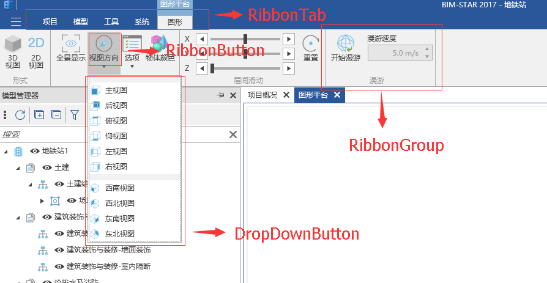
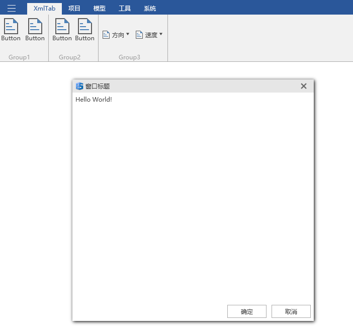
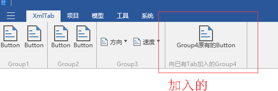
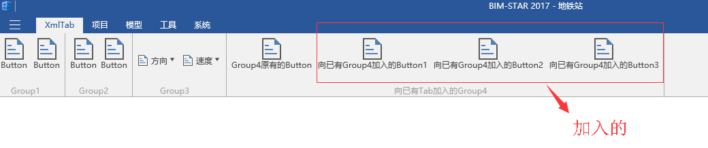
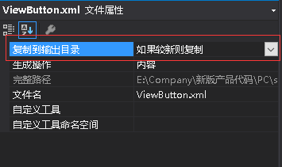
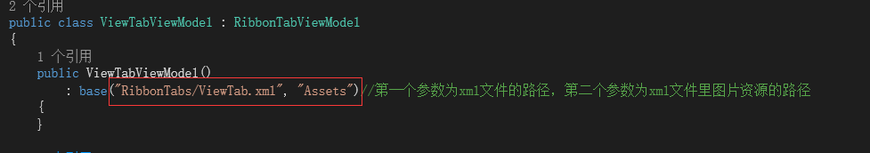

# Ribbon菜单

## 简介

Ribbon即功能区，BIM-STAR2017进入项目后，所处最上方的界面，如下图所示。它是一个收藏了命令按钮和图示的面板。它把命令组织成一组"标签"，每一组包含了相关的命令。每一个应用都插入专属的标签组，提供专属的功能。



## Ribbon菜单对应的相关类简介

- `Mg.Get<IMgRibbon>() `：`Ribbon`菜单管理器，在`Mango`的命名空间中；提供操作管理`Ribbon`菜单的方法。
- `RibbonTabViewModel`：对应`UI`中`RibbonTab` ，对应xml中的`<Tab>`标签。
- `RibbonGroupViewModel` ：对应`UI`中`RibbonGroup`，对应xml中的`<Group>`标签。
- `RibbonButtonViewModel`：对应`UI`中 `RibbonButton`，对应xml中的`<Button>`标签。

## 创建Ribbon菜单（两种方式）

### Xml方式 创建Ribbon 菜单

1.`Xml`配置文件的方式 创建`Ribbon` 菜单。示例源码中`ViewTab.xml`文件中的完整代码如下所示。

```xml
<?xml version="1.0" encoding="utf-8" ?>
<Tab Header="XmlTab" Name = "XmlTab">
  <Group Header="Group1" Name="Group1">
    <Button Text="Button" ButtonSize="Large" CollapseToMedium="Never" LargeImage="测试图片.png" SmallImage="测试图片16.png" Click="ShowWindow" />
    <Button Text="Button" ButtonSize="Large" CollapseToMedium="Never" LargeImage="测试图片.png" SmallImage="测试图片16.png" Click="ShowWindow" />
  </Group>
  <Group Header="Group2" Name="Group2">
    <Panel GroupType="Collapsible">
      <Button Text="Button" ButtonSize="Large" CollapseToMedium="Never" LargeImage="测试图片.png" SmallImage="测试图片16.png" Click="ShowWindow" />
      <Button Text="Button" ButtonSize="Large" CollapseToMedium="Never" LargeImage="测试图片.png" SmallImage="测试图片16.png" Click="ShowWindow" />
    </Panel>
  </Group>
  <Group Header="Group3" Name="Group3">
    <DropDownButton Text="方向" ButtonSize="Medium"  LargeImage="测试图片.png" SmallImage="测试图片16.png">
      <ContextMenu>
        <MenuGroupItem />
        <ContextMenuItem Header="上" Icon="测试图片16.png" Click="ShowWindow" />
        <MenuGroupItem />
        <ContextMenuItem Header="下" Icon="测试图片16.png" Click="ShowWindow" />
        <MenuGroupItem />
        <ContextMenuItem Header="左" Icon="测试图片16.png" Click="ShowWindow" />
        <MenuGroupItem />
        <ContextMenuItem Header="右" Icon="测试图片16.png" Click="ShowWindow" />
      </ContextMenu>
    </DropDownButton>
    <DropDownButton Text="速度" ButtonSize="Medium"  SmallImage="测试图片16.png">
      <ContextMenu>
        <MenuGroupItem />
        <ContextMenuItem Header="快" Icon="测试图片16.png" Click="ShowWindow" />
        <MenuGroupItem />
        <ContextMenuItem Header="慢" Icon="测试图片16.png" Click="ShowWindow" />
      </ContextMenu>
    </DropDownButton>
  </Group>
</Tab>
```

- `Tab` 标签的属性：`Header`的值为显示的名称，`Name`为该`Tab`唯一的标识符（可通过Ribbon管理器传递此值获取对应的`RibbonTabViewModel`对象）。每一个`<Tab>`标签都将被解析成一个`RibbonTabViewModel`对象，`RibbonTabViewModel`类拥有的属性也就是`<Tab>`标签拥有的属性。
- `Group` 标签的属性：`Header` 的值为显示的名称，`Name`为该`Group`唯一的标识符（可通过Ribbon管理器传递此值获取对应的`RibbonGroupViewModel `对象）。每一个`<Group>`标签都将被解析成一个`RibbonGroupViewModel`对象，`RibbonGroupViewModel`类拥有的属性也就是`<Group>`标签拥有的属性。
- `Button` 标签的属性：`Text`的值为显示的名称，`Click `为点击事件的方法名称，`LargeImage`为大图标的名称， `SmallImage`为小图标的名称， `ButtonSize` 为按钮的尺寸，其值为`Large`，`Medium`，`Small`。每一个`<Button>`标签都将被解析成一个`RibbonButtonViewModel`对象，`RibbonButtonViewModel`类拥有的属性也就是`<Button>`标签拥有的属性。
- `DropDownButton` 标签的属性：`Text`的值为显示名称，`Click `为点击事件的方法名称，`LargeImage`为大图标的名称， `SmallImage`为小图标的名称， `ButtonSize` 为按钮的尺寸，其值为`Large`，`Medium`，`Small`。每一个`<DropDownButton>`标签都将被解析成一个`RibbonDropDownButtonViewModel`对象，`RibbonDropDownButtonViewModel`类拥有的属性也就是`<DropDownButton>`标签拥有的属性。
- `ContextMenu `标签对应下拉的菜单。
- `MenuGroupItem`标签对应下拉菜单项的分组。
- `ContextMenuItem`标签对应具体的下拉菜单项，`Header`的值为显示名称，`Click `为点击事件的方法名称，`Icon`为图标的名称 。

2.创建`ViewTab.xml`文件对应的`ViewModel` ，并继承`ViewTab.xml`中根元素对应的`VM`类，由于`ViewTab.xml`中的根元素是`Tab`，因此该`ViewTabViewModel`继承`RibbonTabViewModel`。`ViewTabViewModel.cs`完整代码如下。`ViewTabViewModel`将会解析`ViewTab.xml`中的内容。由于`ViewTab.xml`中的菜单按钮使用到了一些图片，这些图片在项目的`Assets`文件夹下，因此需要把`Assets`传入，程序才会定位到图片所在的位置。由于`ViewTab.xml`中的菜单按钮使用到了一些命令，因此需要把这些命令注册好，否则点击按钮就不会有事件发生。

```c#
using Mango;
using Mango.ViewModels;

namespace DemoApp.ViewModels.RibbonTabs
{
    public class ViewTabViewModel : RibbonTabViewModel
    {
        public ViewTabViewModel()
            : base("RibbonTabs/ViewTab.xml", "Assets")//第一个参数为xml文件的路径，第二个参数为xml文件里图片资源的路径
        {
        }

        protected override void OnLoadingLayout()
        {
            base.OnLoadingLayout();
            RegisterCommand("ShowWindow", OnShowWindow);//注册xml文件里的按钮点击事件，第一个参数为xml文件里的按钮点击事件名，第二个参数为执行方法
        }

        private void OnShowWindow()
        {
            var firstVm = new FirstViewModel();
            var vm = new DialogViewModel(firstVm)
            {
                Title = "窗口标题",
                Width = 500,
                Height = 500
            };
            var result = Mg.Get<IMgDialog>().ShowDialog(vm);
            if (result == CloseResult.Ok)
            {
                //点击窗口的确定按钮后需要执行的代码
            }
        }
    }
}
```

3.然后在`DemoApp`文件的应用启动方法`OnStartupAsync`中，添加如下代码，就可以把`ViewTab.xml`文件中配置的菜单显示出来了。其中的第三个参数是 插入的`Tab`所在的位置，如果为0，则显示在第一位。`ViewTabViewModel`会解析`ViewTab.xml`里的菜单数据，然后把得到的菜单往程序的菜单栏里插入。

```c#
        protected override async Task OnStartupAsync()
        {
            Mg.Get<IMgRibbon>().InsertRibbonTab(this, new ViewTabViewModel(), 0);
            await Task.Yield();
        }
```

4.运行项目，登录之后进入任意项目，可以发现`ViewTab.xml`配置的菜单全部都显示在了第一个菜单项中，并且按钮都具有相同的点击事件（这是因为我们只注册了一个事件命令），点击菜单按钮就会弹出一个窗体。效果如下图所示。



5.如果要往已知一个已存在的`Tab`插入`Group`，也是同样的道理。首先先配置好一个`xml`文件，即创建一个`ViewGroup.xml`，它的代码如下所示。`Group`下包含需要加入的`Button`组数据。

```html
<?xml version="1.0" encoding="utf-8" ?>
<Group Header="向已有Tab加入的Group4" Name="Group4">
  <Button Text="Group4原有的Button" ButtonSize="Large" CollapseToMedium="Never" LargeImage="测试图片.png" SmallImage="测试图片16.png" Click="ShowWindow" />
</Group>
```

6.然后创建`ViewGroup.xml`文件对应的`ViewModel` ，并继承`ViewGroup.xml`中根元素对应的`VM`类，由于`ViewGroup.xml`中的根元素是`Group`，因此该`ViewGroupViewModel`继承`RibbonGroupViewModel`。`ViewGroupViewModel.cs`完整代码如下。

```c#
using Mango;
using Mango.ViewModels;

namespace DemoApp.ViewModels.RibbonTabs
{
    public class ViewGroupViewModel : RibbonGroupViewModel
    {
        public ViewGroupViewModel()
            : base("RibbonTabs/ViewGroup.xml", "Assets")//第一个参数为xml文件的路径，第二个参数为xml文件里图片资源的路径
        {
        }

        protected override void OnLoadingLayout()
        {
            base.OnLoadingLayout();
            RegisterCommand("ShowWindow", OnShowWindow);//注册xml文件里的按钮点击事件
        }

        private void OnShowWindow()
        {
            var firstVm = new FirstViewModel();
            var vm = new DialogViewModel(firstVm)
            {
                Title = "窗口标题",
                Width = 500,
                Height = 500
            };
            var result = Mg.Get<IMgDialog>().ShowDialog(vm);
            if (result == CloseResult.Ok)
            {
                //点击窗口的确定按钮后需要执行的代码
            }
        }
    }
}
```

7.接着在`DemoApp`文件的应用启动方法`OnStartupAsync`中，添加如下代码，就可以把`ViewGroup.xml`文件中配置的按钮组显示在菜单栏里了。因为之前已经插入了一个`Tab`，所以知道它的属性`Name`为`XmlTab`，所以直接获取这个`Tab`的对象，通过`ViewGroupViewModel`解析`ViewGroup.xml`里的`Group`数据，然后再加入到`Tab`里。有时候可以将一些已知的`tab`的`Name`的值保存在`_config.xml`配置文件中，然后通过`LocalConfig.cs`去解析获取需要的`tab`的`Name`属性。示例源码就是这样的，而不是写死。

```c#
protected override async Task OnStartupAsync()
{
   Mg.Get<IMgRibbon>().InsertRibbonTab(this, new ViewTabViewModel(), 0);
   //已有的RibbonTab中加入RibbonGroup
   _xmlTab = Mg.Get<IMgRibbon>().GetRibbonTab("XmlTab");
   _xmlGroup = new ViewGroupViewModel();
   _xmlTab.Groups.Add(_xmlGroup);
   await Task.Yield();
}
```

8.运行项目，登录之后进入任意项目，可以发现`ViewGroup.xml`配置的菜单按钮组显示在了第一列的菜单里。效果如下图所示。



9.类似的，如果要往已知一个已存在的`Group`插入`Button`，首先先要配置`xml`文件，先创建一个`ViewButton.xml`，它的代码如下所示。

**注意**：由于 `RibbonButtonViewModel`没有`RibbonButtonViewModel("RibbonTabs/ViewTab.xml", "Assets")`方法，所以如果要通过`xml`文件获取`RibbonButton`组数据，只能使用如下的配置文件，外层加上`Group`标签。

```html
<?xml version="1.0" encoding="utf-8" ?>
<Group  Name="Group4">
  <Button Text="向已有Group4加入的Button1" ButtonSize="Large" CollapseToMedium="Never" LargeImage="测试图片.png" SmallImage="测试图片16.png" Click="ShowWindow" />
  <Button Text="向已有Group4加入的Button2" ButtonSize="Large" CollapseToMedium="Never" LargeImage="测试图片.png" SmallImage="测试图片16.png" Click="ShowWindow" />
  <Button Text="向已有Group4加入的Button3" ButtonSize="Large" CollapseToMedium="Never" LargeImage="测试图片.png" SmallImage="测试图片16.png" Click="ShowWindow" />
</Group>
```

10.然后通过`ViewButtonViewModel`继承`RibbonGroupViewModel`去解析`XML`配置文件，然后得到`Group`里的`Button`组，再将这`Button`组插入指定的`Group`。`ViewButtonViewModel`文件代码如下所示。

```c#
using Mango;
using Mango.ViewModels;

namespace DemoApp.ViewModels.RibbonTabs
{
    public class ViewButtonViewModel : RibbonGroupViewModel
    {
        public ViewButtonViewModel()
            : base("RibbonTabs/ViewButton.xml", "Assets")//第一个参数为xml文件的路径，第二个参数为xml文件里图片资源的路径
        {
        }

        protected override void OnLoadingLayout()
        {
            base.OnLoadingLayout();
            RegisterCommand("ShowWindow", OnShowWindow);//注册xml文件里的按钮点击事件
        }

        private void OnShowWindow()
        {
            var firstVm = new FirstViewModel();
            var vm = new DialogViewModel(firstVm)
            {
                Title = "窗口标题",
                Width = 500,
                Height = 500
            };
            var result = Mg.Get<IMgDialog>().ShowDialog(vm);
            if (result == CloseResult.Ok)
            {
                //点击窗口的确定按钮后需要执行的代码
            }
        }
    }
}
```

11.接着在`DemoApp`文件的应用启动方法`OnStartupAsync`中，添加如下代码，就可以把`ViewButton.xml`文件中配置的按钮组显示在菜单栏里了。因为之前已经插入了一个`Group`，所以知道它的属性`Name`为`Group4`，所以直接获取这个`Group`的对象，通过`ViewButtonViewModel`解析`ViewButton.xml`里的数据，然后再加入到`Group4`里。

```c#
protected override async Task OnStartupAsync()
{
    Mg.Get<IMgRibbon>().InsertRibbonTab(this, new ViewTabViewModel(), 0);
    //已有的RibbonTab中加入RibbonGroup
    _xmlTab = Mg.Get<IMgRibbon>().GetRibbonTab("XmlTab");
    _xmlGroupTwo = new ViewButtonViewModel();
    _xmlGroup = Mg.Get<IMgRibbon>().GetRibbonGroup("Group4");
    _xmlGroup.Items.AddRange(_xmlGroupTwo.Items);
    await Task.Yield();
```

12.运行项目，登录之后进入任意项目，可以发现`ViewButton.xml`配置的菜单按钮组显示在了第一列的菜单里。效果如下图所示。



### 代码方式创建Ribbon菜单

- 创建`RibbonTab`：

  ```c#
  Mg.Get<IMgRibbon>().InsertRibbonTab(new RibbonTabViewModel()
  {
         Name = "Tab",//唯一的标识符
         Header = "开始",//显示的名称          
  },index);//Index为顺序，默认为最后一个
  ```


- 创建`RibbonGroup`：

  ```c#
  RibbonGroupViewModel group=new RibbonGroupViewModel()
  {
         Name = "Name",//唯一的标识符
         Header = "Header",//显示的名称                 
  };
  ```


- 将`RibbonGroup`加入`RibbonTab`

  ```c#
   var tab = Mg.Get<IMgRibbon>().GetRibbonTab("TabName");
   tab.Groups.Insert(index,new RibbonGroupViewModel()//index为插入的位置
   {
        Name = "Name",//唯一的标识符
        Header = "Header",//显示的名称
   });
  ```


- 创建`RibbonButton`

  ```c#
  RibbonButtonViewModel buttonVm = new RibbonButtonViewModel()
  {
       Name = "Name",//唯一的标识符
       Text = "Text",//显示的名称
       LargeImage = "图标路径",
       ButtonSize = ButtonSize.Large,
       Click = new RelayCommand(OnClick)//按钮点击事件
  };
  ```


- 将`RibbonButton`加入到`RibbonGroup`

  ```c#
  var tab = Mg.Get<IMgRibbon>().GetRibbonGroup("GroupName");
  tab.Items.Insert(index, new RibbonButtonViewModel()//index为插入的位置
  {
      Name = "Name",//唯一的标识符
      Text = "Text",//显示的名称
      LargeImage = "图标路径",
      ButtonSize = ButtonSize.Large,
      Click = new RelayCommand(OnClick)
  });
  ```

## 移除Ribbon菜单

- 移除`RibbonTab`

  ```c#
  var tab =  Mg.Get<IMgRibbon>().GetRibbonTab("TabName");
  Mg.Get<IMgRibbon>().RemoveRibbonTab(tab);
  ```

- 移除`RibbonGroup`

  ```c#
  var tab = Mg.Get<IMgRibbon>().GetRibbonTab("TabName");//要移除的Group所在的Tab
  var group = Mg.Get<IMgRibbon>().GetRibbonGroup("GroupName");
  tab.Groups.Remove(group);
  ```

- 移除`RibbonButton`

  ```c#
  var group = Mg.Get<IMgRibbon>().GetRibbonGroup("GroupName");
  group.Items.Remove(buttonVm);
  ```

  注意：`buttonVm`为上述创建`RibbonButton`所得到的`VM`类。

## 获取已知的Ribbon菜单对象

1.创建`tab`的配置文件，写入已知的`RibbonTab`的`Name`的值 ，如下（文件名为**`_config.xml`**）：

```xml
<Root InsertTabName="TabName/GroupName">//填写已知的TabName或这GroupName
</Root>
或者
<Root>
  <InsertTabName>TabName/GroupName</InsertTabName>
</Root>
```

2.创建配置文件解析类，解析上述的配置文件 如下（文件名及类名为**`LocalConfig.cs`**）：

```c#
public static class LocalConfig
{
    static LocalConfig()
    {
       //解析xml配置文件
        var root = XDocument.Load(typeof(LocalConfig).GetPluginResPath("_config.xml")).Root;
       //根据配置文件获取对应的节点或属性的值
        InsertTabName = root.Attribute("InsertTabName").Value;
       //InsertTabName = root.Element("InsertTabName").Value;
    }
    public static string InsertTabName { get; }
}
```

3.通过解析类`LocalConfig`可以得到当前的`Ribbon` 的`Name`的值，然后通过`GetRibbonXXX`就可以获取到菜单对象了，然后就可以对他们进行操作。当然了，你可以跳过前面的两个步骤，直接写死，不过不建议这么做。

```c#
var tab = Mg.Get<IMgRibbon>().GetRibbonTab(LocalConfig.InsertTabName);//获取指定的tab对象
或
var group= Mg.Get<IMgRibbon>().GetRibbonGroup(LocalConfig.InsertTabName);//获取指定的group对象
```

**注意**： 在应用的卸载方法中需要移除此应用中定义的相关菜单。

## Q/A

------

**Q**：`RibbonButton`样式怎么改变？

**A**：最常用的`RibbonButton`有两种一种是普通的`Button`，另一种为`DropDownButton`  

​	都有两种显示方式（通过`ButtonSize`属性控制)。

------

**Q**：已经按照步骤配置 但还是没有在`Ribbon`菜单中显示 

**A**：请先检查所在的已有`Tab`或者`Group`的应用是否有加载；若没有，则需要把对应的应用先加载出来；若还是没有显示新建的`Ribbon`菜单，右键xml文件选择属性，检查是否如下图所示。如果是通过xml方式创建的菜单，还有一种可能就是对应的xml文件路径不对，或者命名不对，请仔细核对。





------

**Q**：菜单读取不到图片

**A**：右键图片文件，选择属性，检查图片文件输出方式是否正确。

​      若正确检查`ViewModel`中的图片路径是否正确，如下图所示。


`Assets`为`ViewGroup.xml`中项目中，图片资源所在的文件夹，

------

**Q**：应用卸载时移除菜单，却将整个`RibbonGroup`中的`RibbonButton`移除

**A**：移除菜单是要注意只要移除当前应用所创建的`Ribbon`菜单，所以需要将创建的`RibbonButton`设为全局的以便在卸载的时候使用，代码如下所示。当我们往别人的应用所创建的`Tab`里加入按钮组，则我们只需要卸载按钮组即可。

```c#
private RibbonButtonViewModel buttonVm = CreateRibbonButton();

public void RemoveRibbonButton()
{
    var group = Mg.Get<IMgRibbon>().GetRibbonGroup("GroupName");
    group.Items.Remove(buttonVm);
}
```

## Ribbon菜单基本控件

通过前面的了解，可以知道，xml文件里的`<Tab>`对应的是`RibbonTabViewModel`类，`<Group>`对应的是`RibbonGroupViewModel `类，`<Button>`对应的是`RibbonButtonViewModel `类。要想在菜单栏里添加Ribbon控件只能先添加一个`<Tab>`，再往`<Tab>`里添加`<Group>`，最后才可以在`<Group>`里添加一些Ribbon菜单的基本控件，例如`<Button>`，同样的，代码创建也是如此，先往`RibbonGroupViewModel`对象里的`Items`加入`RibbonButtonViewModel `或者其他基本控件的`Vm`，再将`RibbonGroupViewModel`添加到`RibbonTabViewModel `对象里的`Groups`里。

**基类RibbonItemViewModel**

Ribbon菜单的每一个基本控件都有对应的`RibbonXXXXViewModel` ，都是继承或者间接继承`RibbonItemViewModel`类，因此都具有以下属性，这些属性都可以在xml文件中的每一个Ribbon菜单基本控件的标签中使用。

| 属性名                  | 类型                         | 描述        |
| -------------------- | -------------------------- | --------- |
| Name                 | string                     | 名称，即唯一标识符 |
| ToolTip              | string                     | 工具提示      |
| ScreenTipTitle       | string                     | 屏幕提示的标题   |
| ScreenTipDescription | string                     | 屏幕提示的描述   |
| ScreenTipIcon        | string                     | 屏幕提示的图标   |
| Margin               | Thickness                  | 外边距       |
| IsEnabled            | bool                       | 是否有效      |
| Properties           | Dictionary<string, object> | 其它属性      |

**基类RibbonHeaderItemViewModel**

Ribbon菜单的部分控件是继承`RibbonHeaderItemViewModel`类，因此会具有以下属性。

| 属性名         | 类型     | 描述   |
| ----------- | ------ | ---- |
| Header      | string | 头部   |
| Height      | double | 高度   |
| Width       | double | 宽度   |
| HeaderWidth | double | 头部宽度 |

**基类RibbonCollectionViewModel**

Ribbon菜单的部分集合类控件是继承`RibbonCollectionViewModel`类，因此会具有以下属性。

| 属性名               | 类型           | 描述       |
| ----------------- | ------------ | -------- |
| Items             | IList        | 下拉框中的项   |
| SelectedItem      | object       | 当前选中的项   |
| SeletedIndex      | int          | 当前选中项的索引 |
| DisplayMemberPath | string       | 默认显示的列   |
| ItemTemplate      | DataTemplate | 项模板      |
| Height            | double       | 项高度      |
| Width             | double       | 项宽度      |

下面将介绍系统提供的Ribbon菜单基本控件。

### BackstageItem

`BackstageItem`对应的`ViewModel`为`RibbonBackstageItemViewModel`，该类是`RibbonItemViewModel`的派生类。 它可在主程序的左侧隐藏菜单栏中添加菜单，通过调用`Mg.Get<IMgRibbon>().InsertBackstageItem()`方法进行添加。当设置属性`IsSelectable`为`True`时，点击该项，则会弹出需要显示的界面。（需把该界面的`ViewModel`赋值给控件的`Content`属性）；当设置`IsSelectable`为`False`时（默认为`False`），则不会弹出界面，仅是一个按钮功能（需设置命令`Command`的执行方法）。

| 属性名          | 类型       | 描述    |
| ------------ | -------- | ----- |
| Header       | string   | 头部    |
| Title        | object   | 标题    |
| IsSelectable | bool     | 是否可选  |
| IsDefault    | bool     | 是否默认  |
| Icon         | string   | 图标    |
| Content      | object   | 内容    |
| IsSeparator  | bool     | 是否分割线 |
| Click        | ICommand | 点击事件  |

### Tab

`Tab`对应的`ViewModel`为`RibbonTabViewModel`。每个应用可以根据自己的需求在主程序的上方菜单栏中添加一个或者多个菜单标签，在应用的启动方法中调用`Mg.Get<IMgRibbon>().InsertRibbonTab()`方法来添加新的菜单标签。

| 属性名                 | 类型                                       | 描述        |
| ------------------- | ---------------------------------------- | --------- |
| Groups              | string                                   |           |
| ContextualGroupName | ObservableCollection<RibbonGroupViewModel> | Ribbon菜单组 |
| IsSelected          | bool                                     | 是否被选中     |
| Header              | object                                   | 头部        |

### Group

`Group`对应的`ViewModel`为`RibbonGroupViewModel`。 其中`LauncherVisibility`控制图标的可见性，`Items`为`Group`的具体显示内容，具体的`Item`可以是任何按钮控件、下拉列表控件以及`RibbonGallery`控件，除此之外还可以是控件面板，因为这些控件都继承或间接继承了`RibbonItemViewModel`。

| 属性名                | 类型                                       | 描述            |
| ------------------ | ---------------------------------------- | ------------- |
| Header             | object                                   | 头部            |
| LauncherVisibility | Visibility                               |               |
| Items              | ObservableCollection<RibbonItemViewModel> | Ribbon组里面的所有项 |
| Launch             | ICommand                                 |               |

### Button

`Button`对应的`ViewModel`为`RibbonButtonViewModel`，该类是`RibbonItemViewModel`的派生类，`RibbonItemViewModel`具有的属性它都具有，下面不再详述，仅列出该类独有的属性。

| 属性名              | 类型                  | 描述                                       |
| ---------------- | ------------------- | ---------------------------------------- |
| Content          | string              | 内容                                       |
| Text             | string              | 文字                                       |
| ButtonSize       | 枚举ButtonSize        | 按钮尺寸（Large、Medium、Small）                 |
| SmallImage       | string              | 小图标                                      |
| LargeImage       | string              | 大图标                                      |
| Click            | ICommand            | 按钮点击命令                                   |
| CollapseToMedium | 枚举CollapseThreshold | 当组变为Medium时，按钮的缩放行为（Never、WhenGroupIsMedium、WhenGroupIsSmall） |

### ButtonGroup

`ButtonGroup`对应的`ViewModel`为`RibbonButtonGroupViewModel`，该类是`RibbonItemViewModel`的派生类。

| 属性名          | 类型                                       | 描述          |
| ------------ | ---------------------------------------- | ----------- |
| Buttons      | ObservableCollection<RibbonButtonViewModel> | 按钮组中所有按钮的集合 |
| IsSmallGroup | bool                                     | 是否是小的按钮组    |

### DropDownButton

自定义带有下拉菜单的组件。`DropDownButton`对应的`ViewModel`为`RibbonDropDownButtonViewModel`，该控件是`RibbonButtonViewModel`的派生类（派生属性详见`Button`介绍）。

| 属性名                         | 类型              | 描述               |
| --------------------------- | --------------- | ---------------- |
| DropDownContent             | object          | 下拉栏内容            |
| DropDownContentTemplate     | DataTemplate    | 下拉栏模板            |
| DropDownPlacement           | 枚举PlacementMode | 下拉内容的位置          |
| DropDownIndicatorVisibility | Visibility      | 下拉箭头的可见性         |
| DropDownHeight              | double          | 下拉内容的高度，默认自动计算高度 |
| DropDownWidth               | double          | 下拉内容的宽度，默认自动计算宽度 |

属性 `DropDownContent`对应`RibbonContextMenuViewModel`类的实例。可选择添加`RibbonMenuGroupItemViewModel`类的实例或`RibbonContextMenuItemViewModel`类的实例作为`RibbonContextMenuViewModel`的子项，在此约定先添加前者然后添加后者，详见示例代码。`RibbonMenuGroupItemViewModel`包含`Header`标题属性，其`Items`属性只能添加`RibbonListGalleryViewModel`类的实例。`RibbonListGalleryViewModel`详见`ListGallery`介绍，`RibbonContextMenuItemViewModel`详见`ContextMenu`介绍，如下代码所示。

```c#
var dropDownContent = new RibbonContextMenuViewModel();
var groupItem = new RibbonMenuGroupItemViewModel {Header = "Gallery1的标题"};
var gallery = new RibbonListGalleryViewModel();
//......		
groupItem.Items.Add(gallery)
dropDownContent.Items.Add(groupItem);
dropDownContent.Items.Add(new RibbonContextMenuItemViewModel
{
   IconColumnWidth = 0,
   IsSeparator = true,
});
dropDownContent.Items.Add(new RibbonContextMenuItemViewModel
{
   Header = "Paste",
   Icon = ImagePath + "pointer.png",
   Command=new RelayCommand(() => this.ShowMessage("DropDownContent->ContextMenu(Paste)"))
});
```

### RadioButton

`RadioButton`对应的`ViewModel`为`RibbonRidiaoButtonViewModel`，该类是`RibbonButtonViewModel`的派生类（派生属性详见`Button`介绍）。`GroupName`属性标识多个`RadioButton`为一组控件，一组控件中最多只有一个`RadioButton`处于选中状态。

| 属性名       | 类型     | 描述    |
| --------- | ------ | ----- |
| IsChecked | bool?  | 是否选中  |
| GroupName | string | 所在组名称 |

### SplitButton

自定义带有下拉菜单的组件，同时具备按钮的点击功能。`splitButton`的对应的`ViewModel`为`RibbonSplitButtonViewModel`，该类是`RibbonDropDownButtonViewModel`的派生类（相关属性详见`DropDownButton`介绍，该控件的不同之处上半部是`Button`， 可点击并触发命令方法）。

| 属性名                  | 类型   | 描述       |
| -------------------- | ---- | -------- |
| IsToggle             | bool | 是否Toggle |
| IsChecked            | bool | 是否选中     |
| IsTextInMiddleButton | bool | 文字是否在按钮中 |

### ToggleButton

具有选中和未选择状态双状态的按钮。`ToggleButton`对应的`ViewModel`为`RibbonToggleButtonViewModel`，该控件是`RibbonButtonViewModel`的派生类（派生属性详见`Button`介绍）。属性`IsChecked`，标明按钮的状态是否选中。

| 属性名       | 类型    | 描述   |
| --------- | ----- | ---- |
| IsChecked | bool? | 是否选中 |

### ColorPicker

颜色选择器。`ColorPicker`对应的`ViewModel`为`RibbonColorPickerViewModel`，该类是`RibbonHeaderItemViewModel`的子类（派生属性详见它的介绍）。

| 属性名          | 类型           | 描述      |
| ------------ | ------------ | ------- |
| Color        | Color        | 当前选择的颜色 |
| ColorChanged | EventHandler | 颜色改变事件  |

### ComboBox

可自定义的下拉菜单框。`ComboBox`对应的`ViewModel`为`RibbonComboBoxViewModel`，该控件是集合性质的类，因此它是`RibbonCollectionViewModel`的派生类。属性`SelectedItem`为当前选中的项，`Items`可以为任何自定义类。

| 属性名                 | 类型                      | 描述      |
| ------------------- | ----------------------- | ------- |
| SelectedValuePath   | string                  | 选中的值的路径 |
| SelectedValue       | object                  | 选中的值    |
| SelectedItemChanged | EventHandler<EventArgs> | 选择项改变事件 |

### ContextMenu

`ContextMenu`对应的`ViewModel`为`RibbonContextMenuViewModel`，该类是`RibbonItemViewModel`的派生类。属性`Items`包含的子项为`RibbonContextMenuItemViewModel`类的实例。该控件为层级关系类型控件，即`Items`可添加`RibbonContextMenuItemViewModel`类的实例，虽可添加多层菜单，但约定最多延伸两层。该控件一般不会单独使用，而是嵌套在`DropDownButton`与`Gallery`等控件中进行使用。

| 属性名   | 类型                                       | 描述    |
| ----- | ---------------------------------------- | ----- |
| Items | ObservableCollection<RibbonItemViewModel> | 所有的子项 |

### ContextMenuItem

`ContextMenuItem`对应的`ViewModel`为`RibbonContextMenuItemViewModel`， 该类是`RibbonItemViewModel`的派生类。属性`Items`可以继续嵌套自身类型的对象。

| 属性名             | 类型                                       | 描述     |
| --------------- | ---------------------------------------- | ------ |
| Items           | ObservableCollection<RibbonContextMenuItemViewModel> | 子项的集合  |
| Icon            | string                                   | 图标     |
| Header          | object                                   | 头部     |
| IsSeparator     | bool                                     | 是否是分隔符 |
| IconColumnWidth | double                                   | 图标列宽度  |
| IsCheckable     | bool                                     | 是否可勾选  |
| IsChecked       | bool                                     | 勾选状态   |
| GroupName       | string                                   | 组名     |
| Click           | ICommand                                 | 点击事件   |

### ContextualGroup

`ContextualGroup`对应的`ViewModel`为`RibbonContextualGroupViewModel`，该类是`RibbonViewModelBase`的派生类。

| 属性名      | 类型     | 描述   |
| -------- | ------ | ---- |
| IsActive | bool   | 激活状态 |
| Header   | string | 头部   |

### Custom

`Custom`对应的`ViewModel`为`RibbonCustomViewModel`，该类是`RibbonItemViewModel`的派生类。

| 属性名      | 类型           | 描述   |
| -------- | ------------ | ---- |
| Template | DataTemplate | 模板   |

### DatePicker

日期时间选择器。`DatePicker`对应的`ViewModel`为`RibbonDatePickerViewModel`，该类是`RibbonHeaderItemViewModel`的派生类。其中`Mode`为枚举类型，有`DateTime(显示日期和时间)`、 `Date(显示日期)`、 `Time(显示时间)`。 

| 属性名             | 类型           | 描述       |
| --------------- | ------------ | -------- |
| DateTime        | DateTime?    | 当前选则的时间  |
| Mode            | DateTimeMode | 显示类型     |
| DateTimeChanged | EventHandler | 选择日期变化事件 |

### GalleryItem

`GalleryItem`对应的`ViewModel`为`RibbonGalleryItemViewModel`，该类是`RibbonItemViewModel`的派生类。

| 属性名     | 类型     | 描述   |
| ------- | ------ | ---- |
| Content | string | 内容   |
| Image   | string | 图片   |

### Gallery

`Gallery`对应的`ViewModel`为`RibbonGalleryViewModel`，该类是`RibbonItemViewModel`的派生类。该控件是集合性质的控件，需要订阅`SelectedItemChanged`事件，达到监听事件的目的。属性`PopupMenu`为`RibbonContextMenuViewModel`的实例(详见`ContextMenu`介绍)，属性`Items`的值为`RibbonGalleryItemViewModel`的实例集合。

| 属性名                         | 类型                                       | 描述           |
| --------------------------- | ---------------------------------------- | ------------ |
| Items                       | ObservableCollection<RibbonGalleryItemViewModel> | 子项集合         |
| PopupMenu                   | RibbonContextMenuViewModel               | 弹出菜单         |
| Content                     | string                                   | 内容           |
| Icon                        | string                                   | 图标           |
| SelectedItem                | RibbonGalleryItemViewModel               | 当前选中的项       |
| DisplayMemberPath           | string                                   | 默认显示的列       |
| ViewportWidth               | double                                   | 可视区域宽，默认240  |
| ViewportHeight              | double                                   | 可视区域高，默认68   |
| ItemWidth                   | double                                   | 每一项的宽        |
| ItemHeight                  | double                                   | 每一项的高        |
| PopupViewportWidth          | double                                   | 弹出菜单的宽       |
| PopupViewportHeight         | double                                   | 弹出菜单的高       |
| PopupLaunchButtonVisibility | Visibility                               | 弹出菜单的按钮的可见状态 |
| SelectedItemChanged         | EventHandler<EventArgs>                  | 选择项变化事件      |

### ListGallery

`ListGallery`对应的`ViewModel`为`RibbonListGalleryViewModel`，该类是`RibbonItemViewModel`的派生类。该控件是集合性质的控件，需要订阅`SelectedItemChanged`事件，达到监听事件的目的。属性`Items`的值为`RibbonGalleryItemViewModel`的实例集合。该控件一般不会单独使用，而是嵌套在`RibbonMenuGroupItemViewModel`下进行使用（详见`DropDownButton`）。需注意`ListGallery`与`Gallery`两个控件的区别。

| 属性名                 | 类型                                       | 描述          |
| ------------------- | ---------------------------------------- | ----------- |
| Items               | ObservableCollection<RibbonGalleryItemViewModel> | 子项的集合       |
| ViewportWidth       | int                                      | 可视区域宽       |
| ViewportHeight      | int                                      | 可视区域高       |
| ItemWidth           | int                                      | 每一项的宽       |
| ItemHeight          | int                                      | 每一项的高       |
| SelectedItem        | RibbonGalleryItemViewModel               | 当前选择项       |
| DisplayMemberPath   | string                                   | 默认显示的列      |
| SelectedItemChanged | EventHandler<EventArgs>                  | 选择项改变时触发的事件 |

### Label

`Label`对应的`ViewModel`为`RibbonLabelViewModel`，该类是`RibbonItemViewModel`的派生类。

| 属性名  | 类型     | 描述   |
| ---- | ------ | ---- |
| Text | string | 文本   |

### MenuGroupItem

`MenuGroupItem`对应的`ViewModel`为`RibbonMenuGroupHeaderViewModel`，该类是`RibbonItemViewModel`的派生类。

| 属性名     | 类型     | 描述   |
| ------- | ------ | ---- |
| Content | string | 内容   |

### NumericUpDown

数字选择器。`MenuGroupItem`对应的`ViewModel`为`RibbonMenuGroupHeaderViewModel`，该类是`RibbonHeaderItemViewModel`的派生类。属性`ValueFormat`为枚举类型，枚举值有：`Numeric`，`Currency`，`Percentage`。

| 属性名               | 类型           | 描述        |
| ----------------- | ------------ | --------- |
| Value             | double       | 当前值       |
| Minimum           | double       | 最小值       |
| Maximum           | double       | 最大值       |
| ValueFormat       | ValueFormat  | 值格式       |
| IsEditable        | bool         | 是否可编辑     |
| Digits            | int          | 小数点后数字的个数 |
| Unit              | string       | 单位        |
| IsInteger         | bool         | 是否是整数     |
| HideTrailingZeros | bool         | 是否隐藏末尾的0  |
| SmallChange       | double       | 最小更改量     |
| LargeChange       | double       | 最大更改量     |
| ValueChanged      | EventHandler | 值更改触发的事件  |

### Panel

面板。`Panel`对应的`ViewModel`为`RibbonPanelViewModel`，该类是`RibbonItemViewModel`的派生类。该控件是集合性质的控件。属性`GroupType`为枚举类型，枚举值有：`Collapsible`，`OrderedWrap`，`ButtonGroup`，`StackPanel`。属性`Orientation`为枚举类型，枚举值有：`Horizontal`，`Vertical`。

| 属性名         | 类型                                       | 描述    |
| ----------- | ---------------------------------------- | ----- |
| Items       | ObservableCollection<RibbonItemViewModel> | 子项的集合 |
| GroupType   | RibbonGroupType                          | 组的类型  |
| Orientation | Orientation                              | 朝向    |

### Separator

分隔符。`Separator`对应的`ViewModel`为`RibbonSeparatorViewModel`，该类是`RibbonItemViewModel`的派生类。

| 属性名    | 类型     | 描述   |
| ------ | ------ | ---- |
| Height | double | 高度   |
| Width  | double | 宽度   |

### Slide

滑动选择器。`Slide`对应的`ViewModel`为`RibbonSlideViewModel`，该类是`RibbonHeaderItemViewModel`的派生类。

| 属性名          | 类型           | 描述          |
| ------------ | ------------ | ----------- |
| Minimum      | double       | 最小值，默认为0    |
| Maximum      | double       | 最大值，默认为100  |
| Value        | double       | 当前值，默认为50   |
| ShowHandles  | bool         |             |
| SmallChange  | double       | 最小更改量，默认为1  |
| LargeChange  | double       | 最大更改量，默认为10 |
| ValueChanged | EventHandler | 值改变触发的事件    |

### TextBox

可输入文本的文本框。`TextBox`对应的`ViewModel`为`RibbonTextBoxViewModel`，该类是`RibbonHeaderItemViewModel`的派生类。

| 属性名         | 类型           | 描述        |
| ----------- | ------------ | --------- |
| Text        | string       | 文本框的当前文本  |
| TextChanged | EventHandler | 文本改变触发的事件 |


**注：在示例源码中，上述基本控件都会展示，可参考使用。**