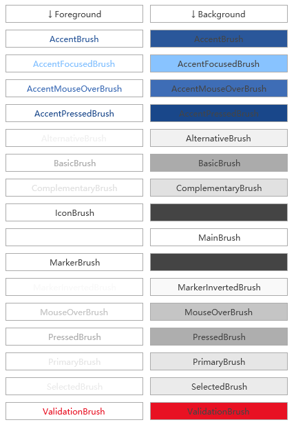

# 控件主题使用

- 控件使用主题颜色

控件使用主题的颜色，包括背景色或者前景色等，下面是代码使用方式示例：

```xml
<Button Foreground="{Binding Source={x:Static mango:M.ThemeManager},Path=AccentBrush}"/>//前景色
<Button Background="{Binding Source={x:Static mango:M.ThemeManager},Path=AccentBrush}"/>//背景色
```

其中，`Path`为指定的`Brush`，不同的则会显示不同的颜色，可根据实际使用情况，选择不同的`Brush`。下面是所有的`Brush`实际显示效果。



- 引用资源文件

  有时候会遇到一种这样的情况：有好多个`View`界面都要用到同一个`Style`资源，如果每个`View`界面都写的话，一旦改起来就会浪费很多时间，这个时候可以将这些公共的`Style`放到一个`xxxxViewRes.xaml`里，然后需要用到的界面再引用这个资源文件也能到同样的效果，并且改起来也很方便。比如`FirstView.xaml`要引用一个外部资源，先建好资源文件`FirstViewRes.xaml`，把多余生成的`FirstViewRes.xaml.cs`文件删掉。`FirstViewRes.xaml`代码如下所示。

  ```Html
  <ResourceDictionary x:Class="DemoApp.Views.FirstViewRes"
               xmlns="http://schemas.microsoft.com/winfx/2006/xaml/presentation"
               xmlns:x="http://schemas.microsoft.com/winfx/2006/xaml"
               xmlns:mc="http://schemas.openxmlformats.org/markup-compatibility/2006"
               xmlns:d="http://schemas.microsoft.com/expression/blend/2008"
               xmlns:telerik="http://schemas.telerik.com/2008/xaml/presentation"
               mc:Ignorable="d">
      <Style x:Key="ResButtonStyle" TargetType="{x:Type Button}">
          <Setter Property="FontSize"  Value="15" />
      </Style>
  </ResourceDictionary>
  ```

  `FirstView.xaml`代码引用如下所示。

  ```Html
  <mango:ViewBase x:Class="DemoApp.Views.FirstView"
               xmlns="http://schemas.microsoft.com/winfx/2006/xaml/presentation"
               xmlns:x="http://schemas.microsoft.com/winfx/2006/xaml"
               xmlns:mc="http://schemas.openxmlformats.org/markup-compatibility/2006"
               xmlns:d="http://schemas.microsoft.com/expression/blend/2008"
               xmlns:mango="clr-namespace:Mango;assembly=Mango.Wpf"
               mc:Ignorable="d"
               d:DesignHeight="500" d:DesignWidth="500">
      <mango:ViewBase.Resources>
          <ResourceDictionary Source="FirstViewRes.xaml" />
      </mango:ViewBase.Resources>
    	<Grid>
        	 <Button Style="{StaticResource ResButtonStyle}" Content="引用外部资源的按钮"/>
      </Grid>
    </mango:ViewBase>
  ```

  这样的话，指定的按钮的字体大小就会按照外部资源的字体大小来设置。具体效果运行示例源码。

  有时候引用外部资源会导致资源更改时，比如程序主题更换了，界面没有立即刷新，这就需要在界面`FirstView.xaml`对应的`FirstView.xaml.cs`里添加资源刷新的方法，代码如下所示。添加了`OnRefreshTheme()`刷新资源。

  ```C#
  using System;
  using System.Windows;

  namespace DemoApp.Views
  {
      /// <summary>
      /// FirstView.xaml 的交互逻辑
      /// </summary>
      public partial class FirstView
      {
          public FirstView()
          {
              InitializeComponent();
          }

          protected override void OnRefreshTheme()
          {
              base.OnRefreshTheme();
              Resources = new ResourceDictionary { Source = new Uri("/DemoApp;component/Views/FirstViewRes.xaml", UriKind.RelativeOrAbsolute) };
          }
      }
  }
  ```

  **注意：**运行示例代码进入项目后，菜单栏->点击`我的菜单`->点击`我的按钮`，`FirstView.xaml`所显示的界面就会出现。
