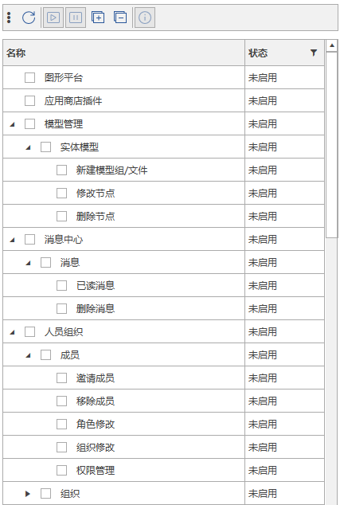

# 应用功能模块的权限管理

- 每个应用中可以设置若干模块，项目的拥有者可以通过在权限管理中对项目成员设置不同的权限去限制成员的操作。下面这些子节点都是每个应用的功能模块，可通过启用或者禁用去限制成员对这个功能模块的操作。如果对应用直接进行禁用，那么该成员登录项目的时候，应用将不会被加载，这个时候不管启没启用功能，都会无效。

  

## 模块定义

- 模块是在应用的配置文件`config.app`中定义的，代码如下所示。在配置文件中 `Module`的属性`Key` (注意是大写的K)是该模块权限的唯一标识，属性`Name`是模块在权限管理中显示的名字，属性`Group`是该模块属于的分组名，属性`EveryoneAccess`表示新成员刚加入项目时对该模块的默认权限是启用还是禁用。

  ```xml
  <?xml version="1.0" encoding="utf-8" ?>
  <App Key="7893CBB8-A058-459B-A7E8-84149E5A0000"
          FileName="DemoApp.dll"
          Name="模块的权限"
          Description="模块的权限使用示例"
          Developer="深圳筑星科技有限公司"
          Version="1.0.0.0"
          WebUrl="http://www.bstar5.com">
    <Modules>
      <Module Key="8D25AB66-3246-4475-B0A4-412B48B54B59" Name="增加学生" Description="增加学生操作" Group="学生" EveryoneAccess="true" />
      <Module Key="ED5AA26C-15C3-4706-A36C-74C00899ACBB" Name="修改学生" Description="修改学生操作" Group="学生" EveryoneAccess="true" />
      <Module Key="4E5A1899-FBAC-402F-A51E-6D4EB3E12095" Name="删除学生" Description="删除学生操作" Group="学生" EveryoneAccess="true" />
    </Modules>
  </App>
  ```

- 当新增一个模块权限的时候就在此基础上累加，不建议删除旧的模块权限。推荐定义一个类来管理这些`key` ，方便查询模块权限的时候有智能提示，也不会写错Key。这里定义一个名为`ModuleKeys`的类  如下：

  ```C#
  public class ModuleKeys
  {
      public const string Create = "8D25AB66-3246-4475-B0A4-412B48B54B59";
      public const string Modify = "ED5AA26C-15C3-4706-A36C-74C00899ACBB";
      public const string Delete = "4E5A1899-FBAC-402F-A51E-6D4EB3E12095";
  }
  ```

## 模块和权限的使用

- 若需要在代码中使用权限来控制状态，可通过如下方式获取该模块的权限。通过`Mg.Get<IMgContext>().GetPrivilegeAsync()`获取指定的功能模块的权限，返回`true`则表示当前用户可使用当前功能。也一次查询多个功能模块的权限。然后通过界面控件绑定异步命令，则可实现实时控制功能的权限。

  ```C#
  namespace DemoApp.ViewModels
  {
      public class FirstViewModel : ViewModelBase
      {
          public FirstViewModel()
          {
            	...
              AddStudent = new AsyncCommand(OnAddStudent, CanAddStudentAsync);
          }

          /// <summary>
          /// 增加一个学生
          /// </summary>
          public AsyncCommand AddStudent { get; private set; }

          private async Task<bool> CanAddStudentAsync()
          {
              return await Mg.Get<IMgContext>().GetPrivilegeAsync(ModuleKeys.Create);
          }

          private void OnAddStudent()
          {
              var num = (UserSource.Count + 1).As<string>();
              UserSource.Add(new User
              {
                  Number = num,
                  Name = $"小{num}",
                  Remark = "新增的"
              });
          }
        	
        	...
      }
  }
  ```

  **说明**：正常情况下，只有创建者才可以在人员组织中针对项目内的成员进行模块权限控制，创建者可以给予他人管理人员组织的权限，那么他人也就获得了管理项目内成员的权限了。

  **注意**：

  - 超级管理员的权限无法配置，默认都为**允许**，权限的设置只针对普通的用户。
  - 默认情况下，项目的创建者是具有应用功能的权限的，所以你可以发现运行示例之后，增加、修改、删除学生的功能按钮都可以点击。但是项目内的其他成员进入该项目后，增加、修改、删除学生的功能按钮是都不可以点击的，这是默认的。只有获得了权限其他成员才可以点击功能按钮。
  - 应用只有**发布**之后才可以在权限管理中进行控制。由于示例应用并没有发布，因此是不能进行权限控制的。
  - 运行示例代码进入项目后，菜单栏->点击`我的菜单`->点击`我的按钮`，`FirstView.xaml`所显示的界面就会出现。

  ​