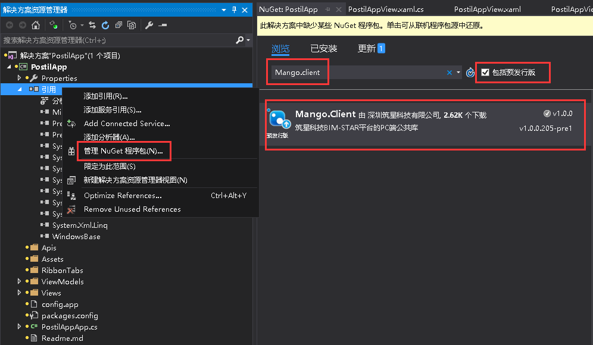
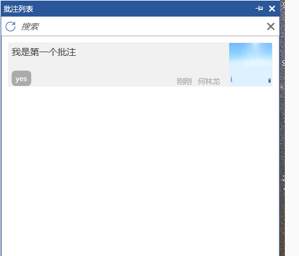

# 创建一个批注管理应用

## 批注应用的加载

+ 这一章是在最基本的应用能被BIM-STAR加载的基础上进行讲解的。如不会建立最基本的应用请先看`应用开发的基本流程`章节，之后再看本章节就会比较明了。

1. 现在教你一个快速创建具有基本架构的应用的方法。首先打开Visual Studio软件（本例使用的是2015版），点击菜单栏中的`工具`->`扩展和更新`，就会弹出如下图所示的界面，左侧选择`联机`，然后在右上角的搜索框内输入`ZX`，然后就会出现`MangoPlugins`模板，下载安装后重启VS即可。

2. 此时新建一个项目，按照下图所示，选择`ClientMangoPlugin`模板，取好应用的名称，解决方案和新建项目的位置应该选择合理的地方。点击确定之后VS就会自动帮我们生成一个拥有应用基础结构的项目了。不过此时的项目还不能启动。

3. 此时会发现如下图所示的问题，这是由于引用已经失效所造成的，将`Mango`和`Mango.Wpf`这两个引用删除掉。

4. 右键`引用`->`管理NuGet程序包`，在弹出的面板的搜索栏上输入`Mango.client`关键字，就能够找到PC端开发BIM-STAR平台的应用所需要的公共库了。请选择安装或更新至最新版本，安装更新好之后项目就会自动添加上最新的`Mango`和`Mango.Wpf`这两个引用。

5. 这个时候选择项目重新生成，就能够成功了。不过这个时候运行程序并不会被BIM-STAR主程序所加载。至于为什么这里不再详述，请看`应用开发的基本流程`章节。此时，修改文件`config.app`的内容。Key是这个应用程序的唯一标识，可以在深圳筑星科技有限公司的官网对该应用进行申请，申请通过后会得到该应用的唯一的一个Key，然后在该文件中填入，这样该应用运行时才会被BIM-STAR主程序所加载。

6. 打开`PostilAppApp.cs`文件，在`OnStartupAsync()`方法中添加如下语句。

   ```C#
       public class PostilAppApp : App
       {
           protected override async Task OnStartupAsync()
           {
               this.ShowMessage("批注应用启动了！");
               await Task.Yield();
           }

           protected override void OnExited()
           {
           }
       }
   ```

   ​

7. 右键项目属性，选择`调试`->`启动外部程序`，添加BIM-STAR的安装目录下的`Shell.Wpf.exe`，如下图所示。

8. 重新编译`PostilApp`项目后，Debug模式下启动项目，登录->点击项目之后会弹出批注应用启动了的提示框，说明我们的应用已经被主程序加载了，如下图所示。


## 访问API

- 由于批注管理需要保存一些数据，因此需要用到API。可以将数据保存到通用数据API里，需要的时候再取出来。通用数据API可以添加数据、更新数据、删除数据、上传文件、下载文件。具体还有哪一些API，可以看一下`通用数据API说明文档`。

1. 首先在`Apis`文件夹下新建`DataApi.cs`文件，由于代码比较多，这里就不贴出来了，具体的请看示例源码即可。这里只抽取三个方法讲解。

2. 下面是一个对`Get`请求的访问方法。`Mg.Get<IMgWeb>()`是框架提供的可访问API的对象，通过该对象的方法`GetResultAsync`发送`Get`请求，`PostilApp`则是项目中继承了`App`类的`PostilApp`类，该方法第一个参数是api地址，只需写版本号后的地址即可。比如我们需要访问版本v1的通用数据data的list，则填`v1/data/list`；第二个参数是访问api需要传入的参数，这里传入数据集名称和筛选集合。类似的，通用数据的其它`Get`方法也是如此访问的。API返回的`result`。如果`result.IsOk`是`true`，则`result.Data`中有数据；`result.IsOk`是`false`，则`result.Data`中没有数据。可以通过`result.Data.As<类型>()`转换成对应的数据类型，也可以通过`result.GetRecords()`或者`result.GetRecord()`，取决于API文档中的返回数据类型说明。如果`record`中字段对应实体类里的属性名，则可直接转换，否则一个一个的转换。

   ```C#
   /// <summary>
   /// 获取自定义数据列表（筛选、分页、排序、映射）
   /// </summary>
   /// <param name="name">数据集名称</param>
   /// <param name="listParams">集合的筛选、分页、排序、映射参数</param>
   /// <returns></returns>
   public static async Task<Result> GetListAsync(string name, ListParams listParams = null)
   {
       var result = await Mg.Get<IMgWeb>().GetResultAsync<PostilApp>("v1/data/list", new
       {
           Name = name,
           ListParams = listParams
       });
       return result;
   }
   ```

3. 下面是调用上面所写好获取自定义数据的方法。`ListParams`是一个筛选数据的类，可通过search的Query语句对数据进行筛选，Query语句是框架提供的查询数据的语法。比如语句`Query.Eq("Name", "小明").And(Query.Gt("age", 18))`，该语句的意思就是查找名字叫小明的并且年龄大于18岁的人的数据。Page属性是对数据进行分页，返回指定页的数据，PageInfo(0, 8)，意思是分为每页8条数据，取第1页的数据。Page为null则不分页。Sort属性则是对数据的某个字段进行排序。Map属性则是对每一条数据的字段进行筛选，需要什么字段的数据就填什么字段，不填则返回所有字段。IsBusy 是 `ViewModelBase`里已声明的通知属性，可以绑定前端的进度条的可见属性`Visibility`，当访问的数据很多需要等待很久的时候，界面的进度条就需要这个通知属性。

   ```C#
   var listParams = new ListParams
   {
       Search = Query.Eq("ProjectId", Mg.Get<IMgContext>().ProjectId),
       Page = new ListParams.PageInfo(0, 8),
       Sort = new[] { new ListParams.SortProperty("CreateTime", false) },
       Map = new[]{ "Title","CreateUser","CreateTime"}
   };
   IsBusy = true;
   var dataResult = await DataApi.GetListAsync(Hubs.Postil.T, listParams);
   if (!dataResult.IsOk)
   {
       Mg.Get<IMgLog>().Error("获取批注信息失败" + dataResult.Message);
       Mg.Get<IMgDialog>().ShowDesktopAlert("获取批注信息失败", dataResult.Message);
       IsBusy = false;
       return;
   }
   var models = dataResult.GetRecords().Select(t => t.As<PostilInfoModel>()).ToList();
   IsBusy = false;
   ```

4. 下面是一个对`Post`请求的访问方法。通过方法`PostAsync`发送`Post`请求，该方法第一个参数是api地址；第二个参数是访问api需要传入的参数。类似的，通用数据的其它`Post`方法也是如此访问的。需要提醒一下：第一次访问通用数据的添加自定义数据api的时候，服务器会根据传入的参数`name`创建一张数据表，表名为`name`的值。由于数据库只能存在唯一的表名，因此为了防止出现多个开发者共用一个数据表名的情况，因此表名建议`开发者字母简称 + 表名`，这样就能避开重复了。万一自己所填的表名已经被别的应用所使用，则返回的`result.IsOk`是`false`，这个时候就该取其它的名字了。应用不能访问别的应用所创建的数据表，对于别个应用的功能，则只能通过别个应用提供的服务来操作别的应用数据。

   ```c#
   /// <summary>
   /// 添加自定义数据（批量）
   /// </summary>
   /// <param name="name">数据集名称</param>
   /// <param name="data">自定义数据内容，数组格式</param>
   /// <returns></returns>
   public static async Task<Result> AddAsync(string name, IRecord[] data)
   {
       var result = await Mg.Get<IMgWeb>().PostAsync<PostilApp>("v1/data/add", new
       {
           Name = name,
           Data = data
       });
       return result;
   }
   ```

5. 下面是批量上传文件的访问方法。`PostAsync`方法的第三个参数是传入的文件流对象，把需要上传的文件流传入即可。

   ```C#
   /// <summary>
   /// 上传文件（批量）
   /// </summary>
   /// <param name="filePaths">文件路径</param>
   /// <param name="projectId">项目Id</param>
   /// <returns></returns>
   public static async Task<Result> UploadFilesAsync(string[] filePaths, Id projectId = null)
   {
       var streamInfos = new List<StreamInfo>();
       foreach (var filePath in filePaths)
       {
           if (!File.Exists(filePath))
               continue;
           var fileName = Path.GetFileName(filePath);
           var name = Path.GetFileNameWithoutExtension(filePath);
           using (var stream = new FileStream(filePath, FileMode.Open))
               streamInfos.Add(new StreamInfo { FileName = fileName, Name = name, Stream = stream });
       }
       var result = await Mg.Get<IMgWeb>().PostAsync<PostilApp>("v1/data/upload_files", new
       {
           ProjectId = projectId
       }, streamInfos.ToArray());
       return result;
   }
   ```

## 转换器

- 转换器主要用于界面控件绑定一些属性的时候，将需要绑定的通知属性的值转成控件属性所需要的类型。

1. 比如下图的一个`Image`控件，当它绑定的`ViewModel`层的图片路径`PictureUrl`通知属性的值为`null`时，该控件就一片空白，为了给它显示默认的图片，则需要使用到转换器`NullToImageCvt`。

   ```C#
   <Image mango:RemoteImageEx.UriSource="{Binding PictureUrl,Converter={StaticResource NullToImageCvt}}" />
   ```

2. `NullToImageCvt.cs`转换器代码如下。`value`参数则是通知属性`PictureUrl`传入的值，可以对该值进行各种情况的判断，`return `你所期望的值。

   ```C#
   namespace PostilMgnt.Converters
   {
       public class NullToImageCvt : IValueConverter
       {
           public object Convert(object value, Type targetType, object parameter, CultureInfo culture)
           {
               if (value == null)
                   return this.GetAppResPath("Assets/暂无图片.png");
               var url = value.ToString();
               if (string.IsNullOrWhiteSpace(url))
                   return this.GetAppResPath("Assets/暂无图片.png");
               return value;
           }

           public object ConvertBack(object value, Type targetType, object parameter, CultureInfo culture)
           {
               return null;
           }
       }
   }
   ```

## 批注的界面实现

- 创建批注主要是在图形平台中浏览模型时，在某个地方某个角落发现了一些问题之后想对这个画面进行截图、批注、保存，后期其他人能够通过批注管理界面对这些批注进行查看和定位。

1. 首先在`Views`文件夹下新建`AddPostilView.xaml`文件，然后在`ViewModels`文件夹下新建对应的`AddPostilViewModel.cs`文件，由于代码比较多，这里就不贴出来了，具体的请看示例源码即可。

2. 对于需要与界面控件绑定的通知属性，需要如下所示进行声明。

   ```C#
   private string _postilTitle;
   /// <summary>
   /// 获取或设置批注标题属性
   /// </summary>
   public string PostilTitle
   {
       get { return _postilTitle; }
       set { Set("PostilTitle", ref _postilTitle, value); }
   }
   ```

3. 对于一些可能有变动的集合需要如下所示进行声明。当`PostilInfoModels`的数据集发生变化，则绑定的控件显示的数据也会发生变化。

   ```C#
   private ObservableCollection<PostilInfoModel> _postilInfoModels;
   /// <summary>
   /// 批注信息的集合
   /// </summary>
   public ObservableCollection<PostilInfoModel> PostilInfoModels
   {
       get { return _postilInfoModels; }
       set { Set("PostilInfoModels", ref _postilInfoModels, value); }
   }
   ```

4. 添加批注的界面会有一些功能按钮，具体的按钮如何绑定请看相应的`按钮命令`章节。

5. 可重写`OnViewLoaded`方法，该方法会在界面加载出来之后执行。`isFirstLoaded`参数标识是否第一次加载界面。

   ```C#
   protected override void OnViewLoaded(bool isFirstLoaded)
   {
       base.OnViewLoaded(isFirstLoaded);
       if (!isFirstLoaded)
           return;
       LoadData();//加载数据
   }
   ```

6. 可重写`OnPropertyChanged`方法，该方法会在与界面控件双向绑定的通知属性发生变化时触发，`propertyName`参数是通知属性名。在该方法中可以对指定的通知属性进行逻辑处理。

   ```C#
   protected override void OnPropertyChanged(string propertyName)
   {
       base.OnPropertyChanged(propertyName);
       if (propertyName == "PostilTitle")
       {
   		if (string.IsNullOrWhiteSpace(PostilTitle))
              this.ShowMessage("批注的标题不能为空！");
       }
   }
   ```

7. 控件`ValidationTip`是框架提供的验证控件，如下所示使用，它绑定的是`Name=TitleTextBox`的控件。控件`TextBox`的`Text`属性绑定的是后端的通知属性`PostilTitle`。

   ```html
   <TextBox Name="TitleTextBox" Text="{Binding PostilTitle,Mode=TwoWay, UpdateSourceTrigger=PropertyChanged, NotifyOnValidationError=True, ValidatesOnDataErrors=True}" TextWrapping="Wrap" />
   <controls:ValidationTip Width="16" Height="16" ValidationElement="{Binding ElementName=TitleTextBox}" />
   ```

   可重写`GetErrorFor`方法，该方法会在界面控件`PostilTitle`发生变化时触发。可以对各种情况进行逻辑处理，`return`的是显示在验证控件上的提示信息。

   ```C#
   protected override string GetErrorFor(string propertyName)
   {
       if (propertyName == "PostilTitle")
       {
           if (string.IsNullOrWhiteSpace(PostilTitle))
               return "标题不能为空！";
           if (PostilTitle.Length > 20)
               return "标题不能超过20个汉字！";
       }
       if (propertyName == "PostilTag")
       {
           if (string.IsNullOrWhiteSpace(PostilTag))
               return "标签不能为空！";
           var inputTagList = PostilTag.Split('，', ',').ToList().Select(t => t.Trim()).ToList();
           if (inputTagList.Any(tag => tag.Length > 8))
               return "每个小标签不能超过8个汉字！";
           if (inputTagList.Count > 4)
               return "最多只能添加4个小标签！";
       }
       return base.GetErrorFor(propertyName);
   }
   ```

8. 批注需要使用到图形平台应用中的一些服务：获取图形平台当前画面的截图文件、获取图形平台当前摄像机的所处的位置。对于应用如何注册\使用服务，请看`服务及插槽插头`章节。

   ```C#
   /// <summary>
   /// 获取图形平台截图中摄像机位置的数据
   /// </summary>
   private bool GetCameraMatrix()
   {
       var r = Mg.Get<IMgService>().Invoke<PostilApp>("GraphicPlatform:GetCameraMatrix");
       if (!r.IsOk)
       {
           Mg.Get<IMgLog>().Error("获取图形平台照相机的位置数据失败！");
           Mg.Get<IMgDialog>().ShowDesktopAlert("获取图形平台照相机的位置数据失败", "无法调用图形管理平台服务，需打开图形管理平台模块！");
           return false;
       }
       _matrixArray = r.Data.As<float[]>();
       return _matrixArray != null && _matrixArray.Length == 16;
   }
   ```

9. 有时候需要对控件`ListBox`里的一些子项进行操作，可以使用框架提供的`mango:Mvvm.Attach`特性，比如对于批注标签的列表，选中了一些标签或者删除了一些标签，这个时候想在`ViewModel`中对这个事件进行处理，那么就可以使用该特性。特性具体的如何使用，请看`View层与ViewModel层之间消息通信`章节。

   ```html
   <ListBox x:Name="listBox" ItemsSource="{Binding PostilTagList}" Background="Transparent">
       <ListBox.ItemTemplate>
           <DataTemplate>
               <Grid x:Name="TagListLayout" Background="Transparent">
                   <ToggleButton IsChecked="{Binding TagIsChecked}" mango:Mvvm.Attach="Checked=OnIsCheckedTag($dataContext);Unchecked=OnIsCheckedTag($dataContext)" Content="{Binding Name}"/>
                   <Button mango:Mvvm.Attach="Click=OnDeleteTag($dataContext)" Style="{DynamicResource NofocusButton}"
                           Visibility="{Binding ElementName=TagListLayout,Path=IsMouseOver,Converter={StaticResource BoolToVisibilityCvt}}">
                   </Button>
               </Grid>
           </DataTemplate>
       </ListBox.ItemTemplate>
   </ListBox>
   ```

10. 应用的某一个功能想要做到实时显示最新信息的时候，可以通过使用广播实现。比如，在同一个项目内的两个成员在同一个时间添加或者删除了同一个批注，那么另外一个成员的界面此时应该及时刷新。第一个参数是广播名，最好取一个唯一的名字，第二个是广播的内容，第三个是广播给的对象：有自己、项目里的所有成员、或者除自己之外的其他成员等。

```C#
   await Mg.Get<IMgWeb>().SendWebMsgAsync("demoPostil/add", addRecord?.Id.ToString(), BoardcastType.ProjectGroup);//发送广播
```

接收广播，如下所示。当接收到指定的广播时会执行指定的方法。第一个参数是传入应用的`PostilApp`类，第二个是指定名的广播，第三个是接收到广播时需要执行的方法。

```C#
   Mg.Get<IMgWeb>().AddWebMsgHandler(App.Instance<PostilApp>(), "demoPostil/add", DataAdd);//接收广播

   private void DataAdd(WebMsgEventArgs eventArgs)
   {
       var addId = eventArgs.Data.As<Id>();//传过来的数据
       if (addId == null)
           return;
   	//处理的逻辑
   }
```

11. 如果想要对批注应用的功能进行权限控制。请看`应用功能模块的权限管理`章节。

12. 在`RibbonTabs`文件夹下添加`PostilGroup.xml`文件，代码如下所示。配置好批注的菜单按钮，在菜单项目栏里添加一个批注的菜单组，详细的请看示例源码。对于更具体的示例源码的解释，请看`Ribbon菜单的使用`章节。

```html
   <?xml version="1.0" encoding="utf-8" ?>
   <Group Name="PostilGroup" Header="批注">
     <Button Text="添加批注" ButtonSize="Large" CollapseToMedium="Never" LargeImage="添加批注.png" SmallImage="添加批注16.png" Click="OpenAddPostilView" />
     <Button Text="查看批注" ButtonSize="Large" CollapseToMedium="Never" LargeImage="查看批注.png" SmallImage="查看批注16.png" Click="OpenCheckPostilView" />
     <Button Text="批注列表" ButtonSize="Large" CollapseToMedium="Never" LargeImage="批注列表.png" SmallImage="批注列表16.png" Click="OpenPostilListView" />
   </Group>
```

新建`PostilGroupViewModel.cs`文件，该文件主要是解析`PostilGroup.xml`文件，提供点击事件。具体请看示例源码，这里代码较多就不贴出来了。然后在`PostilApp.cs`文件中添加如下代码，一般在应用启动的时候进行插入菜单操作、初始化数据表的索引工作、注册提供服务、注册插槽\插头等工作。

```C#
   using Mango.ViewModels;
   using PostilApp.Apis;
   using PostilApp.Entity;
   using PostilApp.ViewModels.RibbonTabs;

   namespace PostilApp
   {
       public class PostilApp : App
       {
           private RibbonTabViewModel _projectTab;
           private PostilGroupViewModel _groupVm;

           protected override async Task OnStartupAsync()
           {
               //获取RibbonTab
               _projectTab = Mg.Get<IMgRibbon>().GetRibbonTab(LocalConfig.InsertTabName);
               if (_projectTab != null)
               {
                   _groupVm = new PostilGroupViewModel();
                   _projectTab.Groups.Add(_groupVm);
               }
               else
                   Mg.Get<IMgLog>().Warn($"没有找到名称为{LocalConfig.InsertTabName}的RibbonTab！批注管理应用无法插入相关Ribbon菜单！");
               await DataApi.CreateIndexAsync(Hubs.Postil.T, new[] { Hubs.Postil.ProjectId });//创建索引
               await DataApi.CreateIndexAsync(Hubs.Tag.T, new[] { Hubs.Postil.ProjectId });//创建索引
               await Task.Yield();
           }

           protected override void OnExited()
           {
               if (_groupVm != null)
               {
                   _projectTab.Groups.Remove(_groupVm);//移除批注的菜单组
                   _groupVm = null;
               }
           }
       }
   }
```

## 批注界面效果图


   

   




