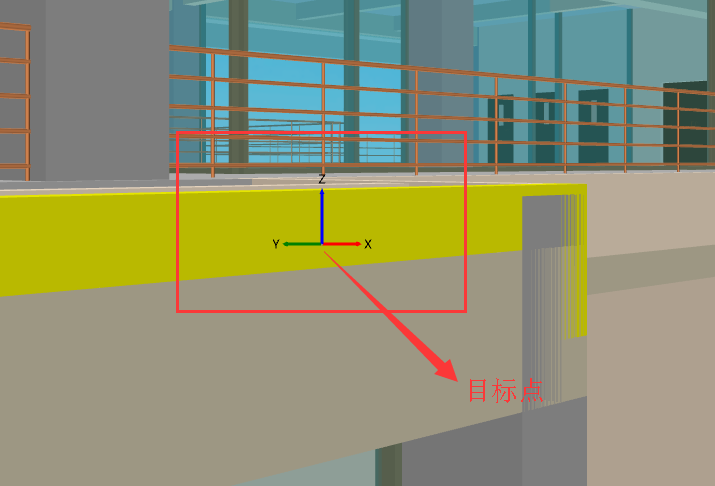

# 图形平台的交互

- 有时候会需要与图形平台进行交互，那么就需要调用图形平台所提供的服务了。
- 调用服务需要知道服务名和参数，这些都写在了服务的文档说明中了。


## 截图

- 如下代码所示，调用该服务，系统会将当前图形平台显示画面的截图保存在给予的路径下。

```C#
var filePath = "D://123.jpg";
Mg.Get<IMgService>().Invoke<DemoApp>("GraphicPlatform:CaptureScreen", filePath);
```


## 获取摄像机位置矩阵

- 如下代码所示，调用该服务，就会获得当前图形平台的摄像机位置的矩阵数据。将此数据保存，当需要的时候就调用设置摄像机位置的服务，就能够回到对应的视角了。

```C#
var result = Mg.Get<IMgService>().Invoke<DemoApp>("GraphicPlatform:GetCameraMatrix");
if (result.IsOk)
{
    var data = result.Data.As<float[]>();
    _cameraMatrix = data;
    var str = data.Aggregate("", (current, t) => current + (t + ",")).TrimEnd(',');
    Mg.Get<IMgDialog>().ShowDesktopAlert("提示", $"摄像机位置矩阵为:{str}。");
}
else
Mg.Get<IMgDialog>().ShowDesktopAlert("提示", result.Message);
```


## 设置摄像机位置矩阵

- 如下代码所示，调用该服务，系统会将当前图形平台的摄像机移动到所给与的位置上。

```C#
Mg.Get<IMgService>().Invoke<DemoApp>("GraphicPlatform:SetCameraMatrix", _cameraMatrix);
```


## 插入图片

- 如下代码所示，调用该服务，系统会将当前图形平台显示画面中插入一张图片，同时会返回一个图片的标识。

```C#
var param = new
{
    ImagePath = this.GetAppResPath("Assets\\logo.jpg"), //string:	图片路径，必填*
    HorizontalAlignment = "Left", //string:	水平对齐，取值为：Left;Center;Right 默认为"Left"
    VerticalAlignment = "Top", //string:	竖向对齐，取值为：Top;Center;Bottom 默认为"Top"
    Left = 0f, //float:	左边距，默认为0f
    Right = 0f, //float:	右边距，默认为0f
    Top = 0f, //float:	上边距，默认为0f
    Bottom = 0f, //float:	下边距，默认为0f
    Width = float.NaN, //float:	图片宽度，默认为float.NaN，表示图片的像素宽度
    Height = float.NaN, //float:	图片高度，默认为float.NaN，表示图片的像素高度
    Opacity = 1f //float: 	图片透明度，默认为1f
};
var result = Mg.Get<IMgService>().Invoke<DemoApp>("GraphicPlatform:InsertImage", param);
if (result.IsOk)
    _graphicPlatformImageKey = result.Data.As<uint>(); //图片标识
else
    Mg.Get<IMgDialog>().ShowDesktopAlert("提示", result.Message);
```


## 移除图片

- 如下代码所示，调用该服务，系统会将当前图形平台显示画面中的指定的图片移除，需传入图片的标识。

```C#
Mg.Get<IMgService>().Invoke<DemoApp>("GraphicPlatform:RemoveImage", _graphicPlatformImageKey);
```


## 定位到指定节点

- 如下代码所示，调用该服务，系统会将图形平台的摄像机对准所指定的节点，显示所选定的节点。比如在一个房子模型中，选中了桌子，则将桌子该节点作为参数调用该服务，摄像机就会用最佳视角去呈现桌子。

```C#
var selNodes = Mg.Get<IMgScene>().SelectedNodes;
Mg.Get<IMgService>().Invoke<DemoApp>("GraphicPlatform:LocateNodes", selNodes);
```


## 突出显示选中的节点

- 如下代码所示，调用该服务，系统会将当前在图形平台中选中的构件节点颜色变黄，其它未选中的构件节点则虚化。

```C#
Mg.Get<IMgService>().Invoke<DemoApp>("GraphicPlatform:OutstandSelectedNodes");
```


## 暂停渲染

- 如下代码所示，调用该服务，图形平台会暂停渲染，当有鼠标操作时，图形平台会自动恢复渲染。

```C#
Mg.Get<IMgService>().Invoke<DemoApp>("GraphicPlatform:PauseRender");
```


## 进入到选择构件模式

- 如下代码所示，调用该服务，图形平台将进入选择构件模式，当选择好构件后点击图形平台的右下角的确定按钮，则该服务会返回所选择的构件。

```C#
IEnumerable<ISpatialNode> selNodes = null;
var result = await Mg.Get<IMgService>().InvokeAsync<DemoApp>("GraphicPlatform:SelectNodes");
if (result.IsOk)
   selNodes = result.Data.AsArray<ISpatialNode>();
```


## 进入到选择点模式

- 如下代码所示，调用该服务，图形平台将进入选择点模式，此时可用鼠标左键点击图形平台的构件的表面，选择构件表面的某个点之后，点击右下角的确定按钮，则该服务会返回构件一些信息，其中包括坐标。可搭配插入图钉的服务使用。

```C#
Tuple<ISpatialNode, Point3D> tuple = null;
var result = await Mg.Get<IMgService>().InvokeAsync<DemoApp>("GraphicPlatform:SelectPoint", null);
if (result.IsOk)
   tuple = result.Data.As<Tuple<ISpatialNode, Point3D>>();
```


## 进入到提醒模式

- 如下代码所示，调用该服务，图形平台会进入提醒模式，也就是图形平台会有一个红色的边框。

```C#
Mg.Get<IMgService>().Invoke<DemoApp>("GraphicPlatform:GoToRemindMode");
```


## 进入到默认模式

- 如下代码所示，调用该服务，图形平台会进入默认模式，假如图形平台此时为提醒模式，则会恢复正常。

```C#
Mg.Get<IMgService>().Invoke<DemoApp>("GraphicPlatform:GoToDefaultMode");
```


## 获取图形平台的目标点

- 什么是目标点。目标点就是如下图所指出的点。当鼠标在图形平台中移动时，目标点会跟着移动。

  

- 如下代码所示，调用该服务，会获得目标点所在的坐标信息。

```C#
var result = Mg.Get<IMgService>().Invoke<DemoApp>("GraphicPlatform:GetTargetCenter");
if (result.IsOk)
    var pos = result.Data.As<Point3D>();
else
    Mg.Get<IMgDialog>().ShowDesktopAlert("提示", result.Message);
```

## 创建python脚本域

- 有时候上面所述的服务并不能满足所有的要求，这个时候需要通过脚本做一些自定义的操作，此时可以通过`GraphicPlatform:CreateScriptScope`服务创建脚本域，然后执行脚本中的方法。下面以显示/移除图钉为例子。

### 显示/移除图钉

1. 选中项目，在项目下新建一个`Models`文件夹，然后在该文件夹下新建一个`ThumbtackInfo.cs`文件，代码如下所示。该类作为一个人图钉信息类，属性`X、Y、Z`则表示该图钉将要插入图形平台中的三维坐标，属性`ImagePath`则表示图片所在的位置，`Key`是该图钉的唯一标识，移除图钉时是通过该属性去移除的。

   ```C#
       public class ThumbtackInfo
       {
           public string Key { get; set; }
           public float X { get; set; }
           public float Y { get; set; }
           public float Z { get; set; }
           public string ImagePath { get; set; }
       }
   ```

2. 选中项目，在项目下新建一个`Scripts`文件夹，然后在该文件夹下新建一个`Thumbtack.py`文件，该文件为`Python`脚本，内容如下所示。注意通过`from DemoApp import *`将自己应用的动态库名导入。`ShowThumbtack`是一个显示图钉的方法，需要传入一个图钉的信息类，也就是上面我们定义的图钉信息类。`RemoveThumbtack`是一个移除图钉的方法，需要把指定图钉的`key`传入。

   ```python
   import clr
   from Umo3D import *
   from SharpDX import *
   from DemoApp import *

   thumbtackNode = None
   enableThumbtack = True

   def GetThumbtackNode(thumbtackKey) :
       if(thumbtackNode == None) :
           return None
       region = thumbtackNode.Content
       for node in region : 
           if(node.Name == thumbtackKey) :
               return node
       return None

   #显示图钉
   def ShowThumbtack(thumbtackInfo) : 
       global thumbtackNode
       #判断是否存在图钉的根节点，不存在则创建一个根节点
       if(thumbtackNode == None) :
           thumbtackNode = SceneNode()
           thumbtackNode.Content = SpriteRoot("Thumbtack") #图钉根节点名称
           if(enableThumbtack) :
               sceneRoot.Add(thumbtackNode)
   	#获取图钉的节点对象
       node = GetThumbtackNode(thumbtackInfo.Key)
       if(node != None) :
           return
       region = thumbtackNode.Content
       rect3D = Rect3D(Vector3(0,-30,0),60,60)
       model3D = FloaterModel3D(rect3D,Color.Transparent)
       model3D.FaceToCamera = True #是否面向摄像机
       model3D.ImageSource = engine.TextureManager.LoadFromFile(thumbtackInfo.ImagePath)#图钉所在位置

       node = SpriteNode(model3D, str(thumbtackInfo.Key))
       node.Transform.SetMatrix(Matrix.Translation(thumbtackInfo.X,thumbtackInfo.Y,thumbtackInfo.Z))
       region.Add(node) #设置图钉在三维场景中的位置

   #移除图钉
   def RemoveThumbtack(thumbtackKey) : 
       node = GetThumbtackNode(thumbtackKey)
       if(node != None) : 
           node.RemoveSelf()
   ```

3. 选中项目，新建`ThumbtackMgnt.cs`文件，代码如下所示。首先在构造函数中初始化图钉集合。`ShowThumbtack`方法主要是将指定图钉在图形平台中显示出来，显示之前会先调用图形平台提供的服务`GraphicPlatform:CreateScriptScope`去解析我们提供的`Thumbtack.py(Python脚本)`，解析成功后则会返回一个脚本域对象，通过该对象就可以调用脚本中的方法。

   ```C#
   using System;
   using System.Collections.Generic;
   using DemoApp.Models;
   using Mango;

   namespace DemoApp
   {
       internal class ThumbtackMgnt : IDisposable
       {
           private static dynamic _scope;
           public List<ThumbtackInfo> ThumbtackInfoList;

           public ThumbtackMgnt()
           {
               ThumbtackInfoList = new List<ThumbtackInfo>();
           }

           private static void EnsureScropeCreated()
           {
               if (_scope != null)
                   return;
               var filePath = typeof(ThumbtackMgnt).GetAppResPath("Scripts/Thumbtack.py");
               var result = Mg.Get<IMgService>().Invoke<DemoApp>("GraphicPlatform:CreateScriptScope", new
               {
                   FilePath = filePath,
                   typeof(ThumbtackMgnt).Assembly
               });
               if (!result.IsOk)
               {
                   Mg.Get<IMgDialog>().ShowDesktopAlert("提示", result.Message);
                   return;
               }
               _scope = result.Data;
           }

           public void Dispose()
           {
               ThumbtackInfoList.Clear();
               ThumbtackInfoList = null;
           }

           public void ShowThumbtack(ThumbtackInfo ttInfo)
           {
               EnsureScropeCreated();
               if (_scope == null)
                   return;
               var action = _scope.GetVariable<Action<ThumbtackInfo>>("ShowThumbtack");
               if (action == null)
                   return;
               action(ttInfo);
           }

           public void RemoveThumbtack(ThumbtackInfo ttInfo)
           {
               if (_scope == null)
                   return;
               var action = _scope.GetVariable<Action<string>>("RemoveThumbtack");
               if (action == null)
                   return;
               action(ttInfo.Key);
           }
       }
   }
   ```

4. 最后通过如下代码所示的方式就可以显示\移除图钉了。

   ```C#
   var mgnt = new ThumbtackMgnt();            
   mgnt.ThumbtackInfoList.Add(new ThumbtackInfo
   {
       X = 0,
       Y = 0,
       Z = 0,
       Key = Guid.NewGuid().ToString(),
       ImagePath = this.GetAppResPath("Assets/safety.png")//图钉图片所在路径
   });
   foreach (var thumbtackInfo in _mgnt.ThumbtackInfoList)
   {
       mgnt.ShowThumbtack(thumbtackInfo);//显示图钉
   }
   foreach (var thumbtackInfo in _mgnt.ThumbtackInfoList)
   {
       mgnt.RemoveThumbtack(thumbtackInfo);//移除图钉
   }
   ```

   ​

   ​


​